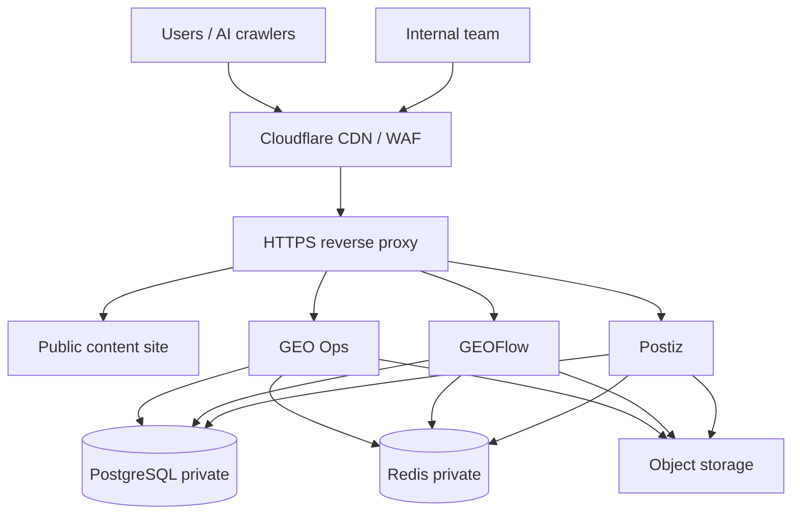
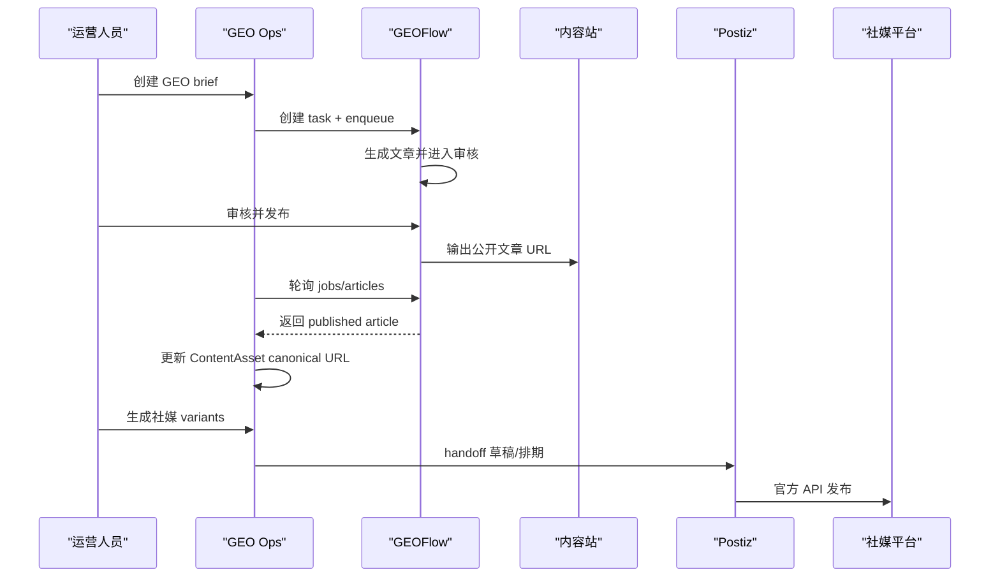

# GEO 内容账号系统生产架构

## 结论

这套架构不是“所有行业唯一最佳”的固定答案，而是 SaaS、内容运营平台、AI 内容系统里非常常见的生产最佳实践组合：

- 前台内容站和后台运营台分离。
- GEO Ops、GEOFlow、Postiz 独立部署，通过 API 集成。
- PostgreSQL、Redis、对象存储不直接暴露公网。
- 所有公网入口走 HTTPS、反向代理、访问控制和日志。
- 生产环境使用托管数据库/缓存/对象存储，或者至少有自动备份和恢复演练。

推荐形态：

```text
Public Internet
  -> Cloudflare / CDN / WAF
  -> HTTPS reverse proxy
     -> content.example.com     Public content / GEO source site
     -> geo.example.com         GEO Ops internal console
     -> geoflow.example.com     GEOFlow admin and API
     -> postiz.example.com      Postiz admin and OAuth callbacks

Private network
  -> GEO Ops app
  -> GEOFlow app
  -> Postiz app
  -> PostgreSQL
  -> Redis
  -> Object storage
```

## 系统边界

当前项目的最新边界是：系统本身可以通过“源站链接”分发内容，但不直接承担社媒账号发布。

也就是说，当前系统负责热点采集、内容生成、公开 URL、`llms.txt`、sitemap 和后续内容包 API；专门的外部分发系统负责连接平台账号、排期、发布和回传状态。Postiz 如果继续使用，只作为可选下游分发系统之一。

| 模块 | 职责 | 访问方式 | 是否公网 |
| --- | --- | --- | --- |
| GEO Ops | 总控台、GEO 监测、brief、内容资产、源站链接、内容包输出、GEOFlow bridge、分发状态回传 | `geo.example.com` | 只给内部团队 |
| GEOFlow | 知识库、AI 内容生成、文章审核、前台信源站发布 | `geoflow.example.com` + API | 后台只给内部团队，发布页可公网 |
| Postiz | 多社媒账号连接、排期、预览、发布 | `postiz.example.com` | 只给内部团队/OAuth 回调 |
| 内容站 | 官网、知识站、FAQ、对比页、文章页、`llms.txt` | `content.example.com` 或主域 | 公网 |
| PostgreSQL | GEO Ops、GEOFlow、Postiz 的业务数据 | 私网连接 | 否 |
| Redis/Queue | 队列、缓存、任务调度 | 私网连接 | 否 |
| 对象存储 | 图片、附件、导出文件、备份 | 私网凭证访问/CDN 分发 | Bucket 不公开写入 |

## 推荐域名

最低可用：

- `geo.example.com`：GEO Ops 总控台。
- `geoflow.example.com`：GEOFlow 后台/API。
- `postiz.example.com`：Postiz 后台和 OAuth callback。
- `content.example.com`：公开内容站，也可以用主域 `www.example.com`。

生产建议：

- `staging-geo.example.com`：GEO Ops 预发。
- `staging-geoflow.example.com`：GEOFlow 预发。
- `status.example.com`：服务状态页，可选。
- `api.example.com`：只有当未来要把 API 单独产品化时再拆。

DNS：

- 公网应用域名指向 CDN/反向代理。
- 数据库、Redis 不配置公网 DNS，不开放公网端口。
- OAuth 平台回调域名必须提前在 LinkedIn、X、微信等平台后台登记。

## 部署环境

本地开发可以在 Windows/macOS/Linux。生产建议使用 Linux：

- MVP：一台 Linux VPS，Ubuntu 22.04/24.04 LTS + Docker Compose。
- 生产：容器化应用 + 托管 PostgreSQL + 托管 Redis + S3/R2 对象存储 + CDN/WAF。
- 企业级：Kubernetes/ECS/Nomad + 私有 VPC + SSO + 审计日志 + 独立预发环境。

MVP 可以单机，但要满足这些底线：

- 只暴露 80/443。
- PostgreSQL 5432、Redis 6379 不映射到公网。
- `.env` 不进 Git。
- 每日自动备份 PostgreSQL。
- HTTPS 自动续期。
- 日志至少保留 14-30 天。

## 网络分层



公网入口：

- `80/tcp`：只用于跳转 HTTPS 和证书签发。
- `443/tcp`：所有外部访问。

私网端口：

- GEO Ops app：`3000`，只给反向代理访问。
- GEOFlow app：按实际容器端口，通常只给反向代理/GEO Ops 访问。
- Postiz app：按实际容器端口，只给反向代理访问。
- PostgreSQL：`5432`，只给应用网络访问。
- Redis：`6379`，只给应用网络访问。

## 数据与集成流



## 安全基线

访问控制：

- GEO Ops、GEOFlow、外部分发系统后台默认不公开给全网团队以外用户。
- 生产建议使用 Cloudflare Access、VPN、SSO、IP allowlist 或应用内 MFA。
- 内容站公开，后台和 API 不允许搜索引擎索引。

密钥：

- 本地开发可用 `.env`。
- 生产使用平台 Secrets、Docker secret、1Password、Vault、AWS/GCP/Azure Secret Manager 等。
- `DATABASE_URL`、`GEOFLOW_API_TOKEN`、AI provider key、Postiz key 不进入 Git。
- token 按职责最小权限拆分，GEOFlow token 只给 `catalog/tasks/jobs/articles` 所需权限。

HTTPS：

- 所有域名启用 HTTPS。
- 反向代理负责证书自动续期。
- 后台 Cookie 设置 `Secure`、`HttpOnly`、`SameSite`，如果接入认证层要同步检查。

## 数据库与备份

生产推荐托管 PostgreSQL：

- 开启自动备份和 PITR。
- 至少每日快照，保留 7-30 天。
- 每月做一次恢复演练。
- 迁移用 `prisma migrate deploy`，不要在生产用 `prisma migrate dev`。

如果 MVP 单机自托管：

- PostgreSQL volume 单独挂载。
- 备份写到机器外部，例如 S3/R2/NAS。
- 不只依赖 Docker volume，因为 volume 不是备份。
- 记录恢复命令和最近一次恢复测试时间。

## 可观测性

最低要求：

- 应用健康检查分层：
  - `/api/healthz` 是公开 liveness，只证明 Next 应用进程可响应，不访问数据库或外部服务。
  - `/api/integrations/geoflow/status` 是登录后的 readiness/dependency 诊断，并行检查 PostgreSQL 和 GEOFlow catalog。
  - 外部依赖检查必须有短超时，GEOFlow catalog 默认 `GEOFLOW_STATUS_TIMEOUT_MS=2500`，不能让慢外部系统拖住总控台。
- 结构化日志：请求 ID、用户 ID、asset ID、GeoFlow task ID、sync run ID。
- 审计日志：关键写入动作进入 `AuditEvent`，记录 actor、action、entity、outcome、request ID 和安全的 metadata。
- 错误告警：GEOFlow 401/422/500、sync 连续失败、队列积压、发布失败。
- 指标：任务成功率、平均生成耗时、published URL 回填率、社媒 handoff 成功率。

生产建议接入：

- Sentry 或同类错误监控。
- Grafana/Prometheus 或云厂商监控。
- 日志平台，例如 Datadog、OpenSearch、Grafana Loki。

## 环境分层

| 环境 | 用途 | 数据 | 域名 |
| --- | --- | --- | --- |
| local | 开发调试 | 本地 demo 或开发 DB | `localhost` |
| staging | 预发验证、OAuth 回调测试 | 脱敏数据 | `staging-*.example.com` |
| production | 正式运营 | 正式数据 | `*.example.com` |

规则：

- staging 和 production 使用不同数据库、不同 token、不同 OAuth app。
- production 不能直接运行本地脚本写库，必须走迁移和审计流程。
- AI provider key 按环境拆分限额，避免测试流量吃掉生产额度。

## 部署模式选择

### 方案 A：MVP 单机 Linux

适合：早期验证、单团队使用、预算较低。

组成：

- 一台 4 vCPU / 8-16GB RAM / 100GB SSD 的 Linux VPS。
- Docker Compose 运行 GEO Ops、反向代理、PostgreSQL、Redis。
- GEOFlow 和 Postiz 可以同机，也可以独立机器。
- Cloudflare DNS + HTTPS。

风险：

- 单点故障。
- 数据库恢复能力弱于托管方案。
- 机器资源会被 AI 生成、队列任务和构建抢占。

### 方案 B：生产推荐

适合：正式运营、多人协作、账号资产重要。

组成：

- GEO Ops、GEOFlow、Postiz 分别容器化部署。
- PostgreSQL 使用托管服务。
- Redis 使用托管服务。
- 文件放 S3/R2，对外通过 CDN。
- Cloudflare/WAF 作为公网入口。
- CI/CD 自动构建、迁移、发布。

这是当前建议采用的生产目标。

### 方案 C：企业级

适合：多品牌、多租户、强合规。

组成：

- Kubernetes/ECS/Nomad。
- 私有 VPC、多可用区。
- SSO/SAML/OIDC、RBAC、审计日志。
- 独立 worker 池处理 GEO 监测、GEOFlow sync、内容包生成和分发状态回传。
- 数据仓库或 BI 系统沉淀 GEO 趋势。

## 当前项目执行项

已经完成：

- GEO Ops Next.js MVP。
- PostgreSQL/Prisma 数据层。
- GEOFlow task bridge。
- GEOFlow sync bridge。
- API 状态检查。
- Dashboard 中的 `Send to GEOFlow` 和 `Sync GEOFlow`。
- `AuditEvent` 操作审计，覆盖内容资产、GEO brief/audit/variant、GEOFlow send/sync。

本次架构优化新增：

- 生产架构说明。
- Linux/Docker Compose 部署样例。
- HTTPS 反向代理样例。
- 生产迁移脚本 `prisma:deploy`。
- README 和 rollout 文档的部署入口。

下一步落地：

1. 确认域名，例如 `geo.example.com`、`geoflow.example.com`、`postiz.example.com`、`content.example.com`。
2. 决定 MVP 单机还是生产推荐托管 DB。
3. 准备生产 `.env` 和 secrets。
4. 部署 PostgreSQL 并执行 `npm run prisma:deploy`。
5. 部署 GEO Ops。
6. 配置 GEOFlow API token/catalog IDs。
7. 配置 Postiz OAuth callback 和 webhook/API。
8. 用 1 个品牌、3 个竞品、20 个 prompt 做端到端 smoke test。
