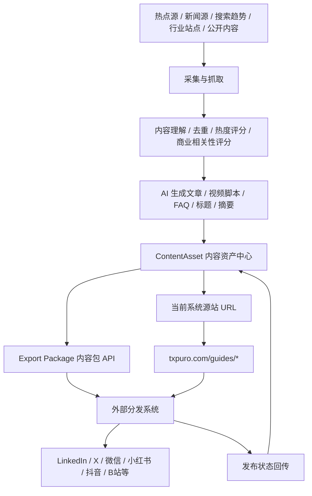

# 内容源站与分发边界

Last updated: 2026-05-06

## 1. 当前系统定位

当前系统本身可以承担“分发”的一部分，但它不是社媒账号发布器。

更准确的定位是：

> 热点情报采集 + AI 内容生成 + 内容源站发布 + 标准化内容包输出。

它负责把热点、话题和选题变成：

- 可访问的公开链接
- 可引用的内容源
- 可抓取的 GEO 页面
- 可交给下游系统的内容包

外部专门的分发系统负责：

- 接收内容包
- 选择账号和平台
- 适配平台格式
- 发布到指定平台
- 回传发布状态

## 2. 什么叫“当前系统也能分发”

这里的“分发”不是直接登录或连接社媒账号，而是以源站链接的方式完成内容出口。

当前系统可以：

- 发布文章或页面到 `txpuro.com/guides/*`
- 输出 `llms.txt`
- 输出 `sitemap-guides.xml`
- 给搜索引擎、AI crawler 和下游分发系统提供稳定 URL
- 让外部分发系统拿这些 URL 做二次分发

当前系统不作为核心职责处理：

- LinkedIn / X / 微信 / 小红书 / 抖音等账号登录
- 社媒平台 OAuth
- 平台账号风控
- 平台排期发布
- 多账号矩阵管理

这些能力应放在独立分发系统里。

## 3. 推荐业务链路



## 4. 系统职责边界

| 模块 | 当前系统负责 | 外部分发系统负责 |
| --- | --- | --- |
| 热点发现 | 是 | 可选 |
| 公开信息采集 | 是 | 否 |
| 内容清洗与评分 | 是 | 否 |
| AI 生成文章 | 是 | 否 |
| AI 生成视频脚本 | 是 | 否 |
| 发布为源站 URL | 是 | 否 |
| 输出内容包 API | 是 | 接收 |
| 平台账号连接 | 否 | 是 |
| 社媒 OAuth | 否 | 是 |
| 多平台格式适配 | 输出建议 | 是 |
| 排期发布 | 否 | 是 |
| 发布结果回传 | 接收 | 是 |

## 5. 内容源站

当前已经上线的内容源站路径：

- `https://txpuro.com/guides`
- `https://txpuro.com/guides/*`
- `https://txpuro.com/llms.txt`
- `https://txpuro.com/sitemap-guides.xml`

这些 URL 的作用：

- 让内容有 canonical URL
- 让 AI crawler 可以抓取和引用
- 让搜索引擎可以收录
- 让销售、运营和分发系统可以直接引用
- 让下游分发系统发布时有稳定落地页

## 6. 内容包出口

后续建议把内容输出统一成 `ExportPackage`，供外部分发系统读取。

建议内容包字段：

- `id`
- `contentAssetId`
- `title`
- `summary`
- `body`
- `canonicalUrl`
- `sourceUrl`
- `language`
- `tags`
- `keywords`
- `recommendedPlatforms`
- `articleFormat`
- `shortPost`
- `videoScript`
- `hookSet`
- `faq`
- `mediaAssets`
- `riskNotes`
- `sourceCitations`
- `status`
- `createdAt`
- `updatedAt`

## 7. API 方向

第一阶段建议给外部分发系统提供这些接口：

- `GET /api/export-packages`
  获取可分发内容包列表。
- `GET /api/export-packages/:id`
  获取单个内容包详情。
- `POST /api/export-packages/:id/claim`
  标记内容包已被下游系统接收。
- `POST /api/distribution-status`
  下游系统回传发布状态。

回传发布状态建议包含：

- `exportPackageId`
- `contentAssetId`
- `platform`
- `accountId`
- `publishedUrl`
- `status`
- `publishedAt`
- `errorMessage`

## 8. Postiz 的位置

Postiz 不再作为当前系统的核心模块。

如果未来仍然使用 Postiz，它只是一个可选下游分发系统，和自研分发系统处于同一层级。

新的关系是：

```text
当前系统
  -> 内容源站 URL
  -> ExportPackage API
  -> 外部分发系统 / Postiz / 其他发布器
```

当前系统不需要直接承担社媒账号风控、OAuth、平台发布失败重试和多账号矩阵管理。

## 9. 抓取与生成边界

为了长期稳定运行，采集和生成需要保留合规边界：

- 优先使用官方 API、RSS、公开 feed 和授权数据源
- 只采集公开可访问内容
- 遵守 robots 和频率限制
- 不做登录态抓取
- 不绕过权限或反爬限制
- 保留来源 URL、采集时间和摘要
- AI 生成时做去重、事实校验和来源引用
- 不直接复制受版权保护的完整文章

## 10. 一句话结论

当前系统负责：

> 把热点和选题变成可发布内容、可引用链接、可分发内容包。

外部分发系统负责：

> 把这些内容包投放到不同平台账号，并把发布结果回传。
