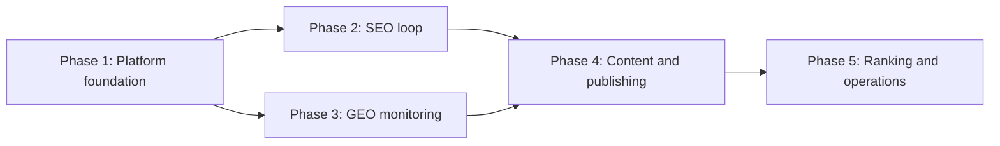

# Multi-Brand GEO + SEO Platform Implementation Roadmap

> **For agentic workers:** REQUIRED SUB-SKILL: Use superpowers:subagent-driven-development (recommended) or superpowers:executing-plans to implement this plan task-by-task. Steps use checkbox (`- [ ]`) syntax for tracking.

**Goal:** Deliver the approved internal multi-client, multi-brand, multi-site GEO + SEO platform through five independently deployable phases.

**Architecture:** SGeoOps is the only business control plane and database writer. Trigger.dev workers, crawlers, LiteLLM, Matomo, SerpBear, and GEOFlow communicate through versioned HTTP contracts and never query SGeoOps tables directly. Every phase builds on tenant-scoped repositories, immutable evidence, an ArtifactStore, and transactional outbox/inbox records established in Phase 1.

**Tech Stack:** Next.js App Router, TypeScript, Prisma 7, PostgreSQL, Better Auth, Zod, Vitest, Playwright, Trigger.dev v4, SiteOne, Unlighthouse, Matomo, LiteLLM, GEOFlow, SerpBear, Docker Compose

---

## Source Of Truth

- Approved design: `docs/superpowers/specs/2026-07-31-multi-brand-geo-seo-platform-design.md`
- Phase 1: `docs/superpowers/plans/2026-07-31-phase-1-platform-foundation.md`
- Phase 2: `docs/superpowers/plans/2026-07-31-phase-2-seo-loop.md`
- Phase 3: `docs/superpowers/plans/2026-07-31-phase-3-geo-monitoring.md`
- Phase 4: `docs/superpowers/plans/2026-07-31-phase-4-content-publishing.md`
- Phase 5: `docs/superpowers/plans/2026-07-31-phase-5-ranking-operations.md`

## Dependency Order



Phases 2 and 3 may be developed in parallel only after Phase 1 is merged and
deployed to staging. Phase 4 depends on evidence and opportunities from both
monitoring loops. Phase 5 begins only after publication and verification have
operated successfully in staging.

## Stable Cross-Phase Contracts

Phase 1 freezes these public interfaces:

```typescript
export type AnalysisStatus =
  | "queued"
  | "running"
  | "succeeded"
  | "partial"
  | "retrying"
  | "failed"
  | "cancelled";

export type ObservationSurface = "api" | "consumer_ui" | "manual";

export interface AnalysisEnvelope {
  contractVersion: "1";
  runId: string;
  clientId: string;
  brandId: string;
  siteId: string;
  siteMarketId: string | null;
  source: string;
  sourceVersion: string;
  adapterVersion: string;
  status: AnalysisStatus;
  startedAt: string;
  finishedAt: string | null;
  rawArtifact: {
    uri: string;
    checksum: string;
    mediaType: string;
    byteSize: number;
  } | null;
  observations: NormalizedObservation[];
  error: {
    code: string;
    message: string;
    retryable: boolean;
  } | null;
}
```

The complete Zod schema lives in
`packages/analysis-contract/src/index.ts`. Later phases may add optional
observation payload fields, but must not change ownership fields, statuses, or
error semantics without a new `contractVersion`.

## Execution Gates

- [ ] **Gate 0: Create an isolated implementation worktree**

Use `superpowers:using-git-worktrees` before implementation. Create a branch
with the `codex/` prefix and keep the approved design and plans on the branch.

- [ ] **Gate 1: Establish a reproducible baseline**

Run:

```bash
npm ci
npm run prisma:generate
npm test
npm run typecheck
npm run build
docker compose config --quiet
```

Expected: all commands exit `0`. The planning workspace had no `node_modules`,
so tests did not execute during plan creation. Record any pre-existing failure
before changing application code.

- [ ] **Gate 2: Complete Phase 1**

Expected evidence:

```text
two-client isolation test passes
Txpuro backfill test preserves all public URLs
Better Auth login and role checks pass
worker cannot connect to the SGeoOps database
artifact, audit, outbox, and inbox transaction tests pass
```

- [ ] **Gate 3: Complete Phases 2 and 3**

Expected evidence:

```text
SEO adapters ingest versioned fixtures and real local crawler output
GEO runs call LiteLLM and never report synthetic answers as production data
all observations retain raw artifacts and ownership scope
opportunities trace back to observations
```

- [ ] **Gate 4: Complete Phase 4**

Expected evidence:

```text
low-risk auto-publication is fail-closed
reviewer approval is required for high-risk content
duplicate requests create one remote publication
post-publication checks preserve evidence
all existing Txpuro URLs remain unchanged
```

- [ ] **Gate 5: Complete Phase 5 and production sign-off**

Expected evidence:

```text
SerpBear proof of concept passes the data-source compliance review
batch reports use ArtifactStore
capacity limits require an approved review
encrypted off-host backups and a restore drill are demonstrated
```

## Commit Policy

Each numbered task in the phase plans ends in one focused commit. Do not mix
schema expansion, data backfill, constraint enforcement, and UI work in a
single commit. Before every commit run the task-specific test, then run:

```bash
npm run typecheck
git diff --check
```

At each phase boundary run:

```bash
npm test
npm run typecheck
npm run build
docker compose config --quiet
```

## Rollback Policy

- Expand schema before backfill; enforce constraints only after validation.
- Deploy code that can read both legacy and new fields before backfilling.
- Keep Txpuro compatibility helpers until Phase 4 public-route tests pass.
- Treat artifacts and approved/published snapshots as immutable.
- Roll back application containers before rolling back a compatible additive
  migration.
- Never delete remote content automatically after a verification failure.

## External Documentation Pins

The plan was reviewed against these versions on 2026-07-31. Upgrade only in a
separate dependency commit with contract fixtures and release-note review:

```text
Better Auth / Prisma adapter  1.6.25
Trigger.dev SDK/build         4.5.9
SiteOne Crawler               2.5.1
Unlighthouse CLI              0.18.0
Matomo Core                   5.12.0
LiteLLM                       1.94.0
SerpBear                      3.1.0
```

Documentation:

- Better Auth Next.js: https://better-auth.com/docs/integrations/next
- Better Auth Prisma: https://better-auth.com/docs/adapters/prisma
- Trigger.dev v4 Docker: https://trigger.dev/docs/self-hosting/docker
- SiteOne reports: https://crawler.siteone.io/features/exports-and-reports/
- Unlighthouse CI: https://unlighthouse.dev/integrations/ci
- Search Console API: https://developers.google.com/webmaster-tools/v1/searchanalytics/query
- Matomo Docker: https://matomo.org/faq/how-to-install/install-matomo-with-docker/
