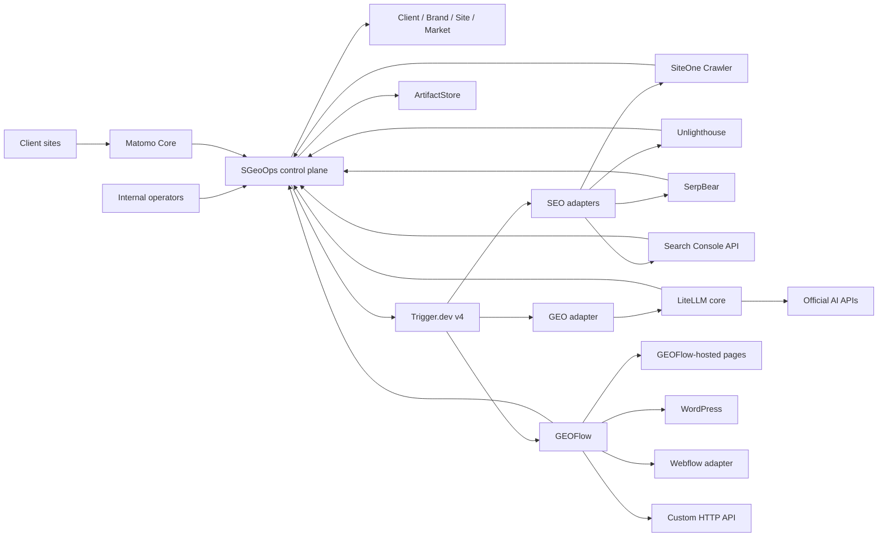
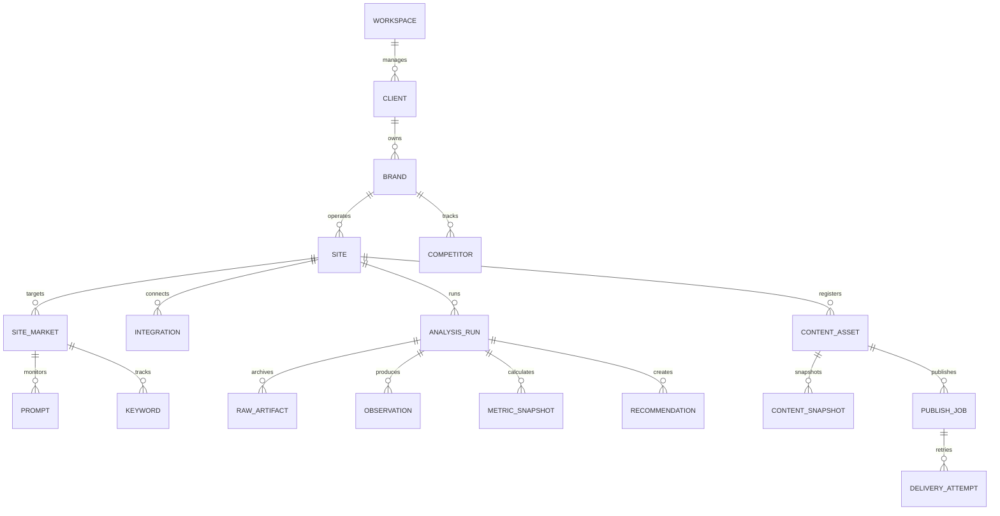

# Multi-Brand GEO + SEO Internal Operations Platform Design

Date: 2026-07-31
Status: Approved design

## 1. Summary

SGeoOps will evolve from a Txpuro-specific GEO dashboard into an internal
operations platform for an agency team that manages multiple clients, brands,
sites, markets, and languages.

The first production target is:

- one internal workspace;
- no client login or self-service portal;
- up to 10 clients and 50 sites;
- full-site SEO monitoring;
- GEO monitoring across OpenAI, Gemini, Anthropic, and Perplexity API surfaces;
- content production and review through GEOFlow;
- platform-hosted pages plus WordPress, Webflow, and custom API publishing;
- risk-based publishing, where low-risk content may publish automatically and
  higher-risk content requires internal review;
- open-source, self-hosted application components;
- official AI and search APIs allowed only as external data sources.

Txpuro becomes the first migrated client, brand, and site. It is no longer the
platform's hard-coded product identity.

## 2. Product Boundary

SGeoOps is the system of record for:

- clients, brands, sites, markets, and internal users;
- monitored prompts, keywords, competitors, and schedules;
- integration registrations and secret references;
- normalized SEO and GEO observations;
- metric snapshots and recommendations;
- opportunity prioritization;
- risk policies and review decisions;
- cross-system job state;
- published content registry, snapshots, and external identifiers;
- unified reporting and audit history.

SGeoOps does not replace the specialized systems it coordinates.

GEOFlow owns:

- knowledge bases and RAG inputs;
- editable article bodies;
- draft and version history;
- content review;
- hosted content pages;
- WordPress and generic HTTP distribution;
- publishing queues and remote content lifecycle.

SEO tools own the execution of individual scans. AI providers own their API
responses. Matomo owns raw visit and conversion collection. SGeoOps imports,
normalizes, and reports their results.

## 3. Goals

1. Give the internal team one place to understand every client, brand, site,
   and market.
2. Combine SEO, GEO, content, publishing, and conversion signals without
   forcing operators to use each specialist tool as a separate control plane.
3. Preserve raw evidence so scores can be recalculated without rerunning
   expensive external calls.
4. Make every recommendation traceable to observations and every publication
   traceable to an approved content version.
5. Permit gradual replacement of specialist tools through stable adapter
   contracts.
6. Keep the first deployment operable for a small internal team on a
   Docker-based Linux environment.

## 4. Non-Goals

The first version will not provide:

- client login, client approval, or a client-facing portal;
- subscriptions, invoicing, plans, or usage billing;
- public SaaS registration;
- social account OAuth or multi-account social publishing;
- automatic publication of high-risk or low-confidence content;
- direct database access between SGeoOps and external components;
- claims that API responses are identical to ChatGPT, Claude, Gemini, or
  Perplexity consumer web experiences;
- support for more than 10 clients or 50 sites without a capacity review.

## 5. Architectural Principles

### 5.1 One Business Control Plane

SGeoOps is the only place that defines client, brand, site, and market
ownership. External tools are internal execution services, not tenant
boundaries and not user-facing products.

### 5.2 Separate Data Ownership

Each component owns its own database. Components may share a PostgreSQL server
for the first deployment, but they must use separate databases, credentials,
and migrations. No service may query another service's tables.

### 5.3 Integration Through Contracts

Components communicate through REST APIs, webhooks, CLI output, files, and
stable external identifiers. Every adapter normalizes its output before the
result enters SGeoOps reporting.

### 5.4 Immutable Evidence

Raw reports, provider responses, approved content snapshots, review decisions,
and metric snapshots are immutable. Corrections create new versions.

### 5.5 Explicit Observation Surface

Every GEO observation records one of:

- `api`;
- `consumer_ui`;
- `manual`.

Metrics for these surfaces are calculated and displayed separately.

### 5.6 Open-Source Runtime

All application components operated by the team must be open source and
self-hostable. External proprietary systems are permitted only as data sources
or publishing destinations. This includes official AI APIs, Google Search
Console, Webflow, and client-owned systems.

## 6. Component Architecture



### 6.1 Selected Components

| Component | License boundary | Responsibility |
| --- | --- | --- |
| SGeoOps | Existing project | Business control plane and reporting |
| GEOFlow | Apache-2.0 | RAG, generation, review, hosted pages, distribution |
| Trigger.dev v4 | Apache-2.0 | Cross-system scheduling and retry |
| SiteOne Crawler | MIT | Full-site technical SEO crawl |
| Unlighthouse | MIT | Sampled Lighthouse and accessibility analysis |
| SerpBear | MIT | Conditional keyword rank tracking |
| Matomo Core | GPL-3.0 | Traffic, events, and conversion collection |
| LiteLLM core | MIT core only | AI provider gateway, routing, retry, and limits |
| Better Auth | MIT | Internal application accounts and sessions |
| SeaweedFS | Apache-2.0 | Optional S3-compatible artifact storage |

Only the open-source core of LiteLLM and Matomo may be used. Enterprise,
premium, or source-available modules are outside the approved baseline.

Langfuse is deferred until provider volume justifies a dedicated LLM
observability system. The first release stores provider call metadata in
SGeoOps and raw responses in the ArtifactStore.

MinIO is not selected because its upstream repository was archived on
2026-04-25. The first deployment uses an `ArtifactStore` interface backed by a
local persistent volume with encrypted off-host backups. SeaweedFS may replace
the local backend when an S3-compatible service is required.

### 6.2 Components Not Selected

- Payload, Strapi, and Wagtail are not selected because GEOFlow
  already covers the approved content and publishing scope.
- n8n is not selected because its Sustainable Use License is not an OSI
  open-source license.
- Directus is not selected because its BSL terms do not satisfy the approved
  open-source requirement.
- Postiz is not selected for the first scope because social account publishing
  is a non-goal.
- Firecrawl is not selected for owned-site technical audits because SiteOne
  covers the required first-phase crawl output with a simpler runtime.

## 7. Service Responsibilities

### 7.1 SGeoOps

SGeoOps provides:

- internal login and role enforcement;
- client, brand, site, and market navigation;
- integration health and credential reference management;
- audit schedules and run history;
- opportunity and recommendation queues;
- content registry and workflow state;
- risk evaluation and review decisions;
- cross-system status aggregation;
- unified GEO, SEO, traffic, conversion, and publishing reports.

### 7.2 GEOFlow

GEOFlow provides:

- knowledge and source management;
- prompt and content production inputs;
- RAG-assisted generation;
- editable drafts and versions;
- review and publication;
- hosted content pages;
- WordPress and generic HTTP destinations;
- remote update and delete operations;
- sitemap, structured data, and `llms.txt` output.

GEOFlow's own queues handle generation, review, and content distribution.
Trigger.dev must not duplicate those internal jobs.

### 7.3 Trigger.dev

Trigger.dev handles only cross-system workflows:

- scheduled SEO scans;
- scheduled GEO prompt runs;
- external data synchronization;
- creation and polling of GEOFlow tasks;
- post-publication validation;
- retry and dead-letter handling across service boundaries.

The existing Trigger.dev v2 worker is end-of-life and must be migrated to v4
before it is used in production.

### 7.4 SEO Services

- SiteOne performs complete site crawls and exports raw structured reports.
- Unlighthouse samples important page templates for performance and
  accessibility; it does not replace SiteOne's URL inventory.
- Search Console supplies owned-site query, page, country, device, and
  indexing data.
- SerpBear is introduced only after the team defines the keyword, country,
  device, frequency, and compliant SERP data-source budget.
- Matomo continuously collects site visits, events, goals, and conversions.

### 7.5 GEO Services

LiteLLM provides one controlled API gateway for official providers. Every call
must include:

- `client_id`;
- `brand_id`;
- `site_id`;
- `site_market_id`;
- `prompt_id`;
- `provider`;
- `model`;
- `locale`;
- `country`;
- `search_enabled`;
- `surface=api`.

Provider API observations must never be reported as consumer web UI results.
Consumer UI measurements enter through separately approved collection or
manual import and retain `surface=consumer_ui` or `surface=manual`.

## 8. Core Data Model



### 8.1 Organization Models

#### `Workspace`

Represents the internal agency team. The first release creates one workspace.

#### `Client`

The primary business isolation boundary and report owner.

#### `Brand`

Stores the canonical brand entity, aliases, products, industry, business
goals, default competitors, and risk category.

#### `Site`

Stores domain, site type, hosting mode, canonical rules, allowed publishing
paths, ownership verification, and active state.

#### `SiteMarket`

Stores country, locale, device defaults, timezone, and market-specific content
and monitoring settings. A site may have multiple markets and languages.

### 8.2 Monitoring Models

#### `Prompt`

Stores a GEO monitoring question, intent, topic, locale, country, active
providers, schedule, and prompt version.

#### `Keyword`

Stores an SEO keyword, target URL, country, device, location, priority, and
schedule.

#### `Competitor`

Stores brand-level competitors with optional market overrides and aliases.

#### `AnalysisRun`

The common run header for SiteOne, Unlighthouse, Search Console, SerpBear,
Matomo imports, and AI providers.

Required fields include:

- ownership IDs;
- `kind`;
- `source`;
- `sourceVersion`;
- `status`;
- `inputHash`;
- schedule or manual trigger;
- start and finish times;
- attempt count;
- error code and safe error summary.

#### `RawArtifact`

Stores the artifact URI, media type, checksum, byte size, source version,
retention date, and redaction state.

#### `Observation`

Stores normalized facts, not scores. Examples include:

- HTTP status;
- canonical mismatch;
- missing title;
- brand mention;
- cited domain;
- answer position;
- keyword position;
- page view;
- conversion.

GEO observations also require `surface`, provider, model, prompt version,
country, locale, and observation time.

#### `MetricSnapshot`

Stores computed metrics and their formula version. Formula changes create a
new metric version rather than rewriting history.

#### `Recommendation`

Stores a traceable recommendation linked to supporting observations. It has
priority, owner, state, due date, resolution, and verification run.

#### `Opportunity`

Combines related recommendations into an actionable business task.

The default priority formula is:

```text
priority = businessValue * expectedImpact * confidence / estimatedEffort
```

Each factor uses a documented 1-5 scale. The calculated score is stored with
the formula version and operator overrides.

### 8.3 Content Models

#### `ContentAsset`

The existing model remains the content registry and receives:

- `clientId`;
- `brandId`;
- `siteId`;
- `siteMarketId`;
- `sourceSystem`;
- `externalContentId`;
- `workflowStatus`;
- `riskLevel`;
- latest approved and published version references.

GEOFlow remains the editable body source. SGeoOps does not provide a second
full-body editor.

#### `ContentSnapshot`

Stores an immutable copy of content at approval or publication time,
including citations, checksum, reviewer, risk decision, and GEOFlow version.

#### `PublishJob`

Stores one publication intent for one content version and destination.

#### `DeliveryAttempt`

Stores each external request, response status, retry time, remote ID, remote
URL, and safe error summary.

### 8.4 Integration Models

#### `Integration`

Stores integration type, scope, endpoint, capabilities, adapter version,
health state, and `secretRef`.

The database must never store provider or publishing credentials in plaintext.
The first deployment uses Docker secrets or encrypted server-side secret files
outside Git. Secret values are resolved only by the adapter process.

#### `OutboxEvent` and `InboxEvent`

Outbox events are written in the same transaction as the business state
change. Inbox events deduplicate callbacks and prevent repeated state
transitions.

## 9. Adapter Contract

Every adapter must return this envelope:

```json
{
  "runId": "run_123",
  "clientId": "client_123",
  "brandId": "brand_123",
  "siteId": "site_123",
  "siteMarketId": "market_123",
  "source": "siteone",
  "sourceVersion": "2.5.1",
  "status": "succeeded",
  "startedAt": "2026-07-31T01:00:00Z",
  "finishedAt": "2026-07-31T01:05:00Z",
  "rawArtifactUri": "artifact://run_123/report.json",
  "rawArtifactChecksum": "sha256:4f89b3c2d0e17a65",
  "observations": [],
  "error": null
}
```

Allowed statuses are:

- `queued`;
- `running`;
- `succeeded`;
- `partial`;
- `retrying`;
- `failed`;
- `cancelled`.

Adapters are versioned. SGeoOps stores the source and adapter versions with
every run so upstream format changes remain diagnosable.

## 10. Metrics

### 10.1 GEO Metrics

The first release calculates:

- brand mention rate;
- citation rate;
- canonical-domain citation rate;
- mean answer position when an ordered answer exists;
- citation share of voice;
- competitor mention share;
- sentiment distribution;
- source-domain coverage;
- prompt coverage by market and provider.

Metrics are segmented by provider, model, surface, country, locale, prompt
version, and date range.

### 10.2 SEO Metrics

The first release calculates:

- crawl success and indexability;
- canonical and redirect health;
- metadata and heading completeness;
- structured-data coverage;
- broken-link rate;
- sampled Lighthouse performance and accessibility;
- Search Console impressions, clicks, CTR, and average position;
- configured keyword visibility;
- organic landing-page traffic and conversions.

### 10.3 Combined Opportunity Metrics

Combined reporting may correlate GEO, SEO, traffic, and conversion changes,
but it must not claim causation. Reports label comparisons as correlations
unless a controlled experiment supports a stronger conclusion.

## 11. Operational Workflow

### 11.1 Site Onboarding

1. Create client, brand, site, and site markets.
2. Verify domain ownership and canonical rules.
3. Configure aliases, products, competitors, prompts, and keywords.
4. Register integrations and test connection health.
5. Configure risk policy and allowed publishing paths.
6. Run the first SEO and GEO baseline.
7. Store the baseline date and metric versions.

### 11.2 Default Schedules

- Matomo collects continuously.
- Search Console synchronizes daily.
- High-value keyword tracking runs daily or every three days.
- SiteOne runs weekly and after important targeted publications.
- Unlighthouse runs weekly against representative page templates.
- GEO prompt baskets run twice weekly and after important publications.
- Consumer UI manual samples run monthly when enabled.

Operators may reduce frequency by site market. Increasing frequency requires
an explicit provider and infrastructure budget review.

### 11.3 Opportunity Flow

1. Adapters create immutable observations.
2. Versioned metric calculators create snapshots.
3. Rule-based detectors create recommendations.
4. Related recommendations are grouped into opportunities.
5. Operators accept, defer, reject, or assign opportunities.
6. Accepted opportunities become existing-page fixes, technical tasks, or
   content briefs.

### 11.4 Content Flow

1. SGeoOps creates a brief with brand, market, keyword, prompt, evidence, and
   expected outcome.
2. SGeoOps creates an idempotent GEOFlow task.
3. GEOFlow uses approved knowledge and citations to create a draft.
4. GEOFlow returns version and workflow state.
5. SGeoOps evaluates publication risk and quality gates.
6. Low-risk content that passes every gate may publish automatically.
7. All other content enters internal review.
8. GEOFlow publishes the approved version to the selected destination.
9. SGeoOps records a `ContentSnapshot`, `PublishJob`, and remote identifiers.
10. Post-publication verification runs before the job is complete.

### 11.5 Automatic Publishing Gates

Automatic publishing is allowed only when all conditions are true:

- the brand and market risk policy classifies the content as low risk;
- the content is outside legal, medical, financial, policy, regulated, and
  other configured sensitive categories;
- required source citations are present and accessible;
- no fact-check blocker is present;
- configured GEO and SEO quality thresholds pass;
- canonical URL and publishing path are valid;
- the destination connection is healthy;
- the exact content version has not already been published.

An unavailable or inconclusive gate results in review. It never results in
automatic approval.

### 11.6 Post-Publication Verification

The job succeeds only after verification confirms:

- the page returns HTTP 200;
- the canonical URL matches the approved value;
- indexing is allowed;
- structured data parses;
- the published checksum matches the approved snapshot where the destination
  supports deterministic retrieval;
- sitemap and `llms.txt` include the expected URL when applicable;
- the external content ID and final URL are recorded.

Failed verification does not automatically delete the remote page. It creates
a high-priority remediation task and preserves the remote identifiers.

## 12. Error Handling

### 12.1 Retry Policy

- network timeouts and retryable `5xx` errors use exponential backoff with
  jitter for up to three attempts;
- `429` responses honor `Retry-After`;
- `401` and `403` disable the integration until an operator revalidates it;
- validation and other non-retryable `4xx` errors fail immediately;
- exhausted jobs enter a dead-letter state and can be replayed by an operator.

### 12.2 Partial Success

Batch runs and multi-site publications may finish as `partial`. Successful
targets remain successful. Failed targets receive independent delivery
attempts and do not roll back unrelated targets.

### 12.3 Idempotency

Publishing uses this stable idempotency key:

```text
clientId:siteId:contentAssetId:contentVersion:destination
```

Repeated callbacks and manual retries must resolve to the same semantic
result. A repeated key with different content returns a conflict.

### 12.4 Provider Failure

If an AI provider is unavailable:

- the run records failure for that provider;
- other providers may continue;
- no synthetic answer is written into production metrics;
- the report shows missing provider coverage;
- scheduled retries remain within the configured daily budget.

## 13. Security and Access

The first release uses Better Auth inside SGeoOps rather than a separate
identity server.

Roles are:

- `Admin`: users, clients, sites, integrations, and system configuration;
- `Operator`: audits, opportunities, briefs, and publishing operations;
- `Reviewer`: high-risk content review and approval;
- `Viewer`: read-only reporting.

Every query and mutation is scoped through workspace and client ownership.
Client A data must never be returned while operating in Client B context.

All writes create `AuditEvent` entries containing:

- actor;
- action;
- outcome;
- request ID;
- workspace, client, brand, and site IDs when applicable;
- entity type and entity ID;
- safe metadata without credentials or full sensitive content.

Public hosted content and internal operations routes use separate host and
middleware policies.

## 14. Deployment

### 14.1 First Production Shape

The first production deployment uses Linux and Docker Compose.

Always-on services are:

- SGeoOps web application;
- SGeoOps cross-system worker;
- GEOFlow web, scheduler, and queues;
- Trigger.dev v4;
- LiteLLM core;
- Matomo Core;
- PostgreSQL;
- Redis;
- reverse proxy;
- backup jobs.

SiteOne and Unlighthouse run as ephemeral, resource-limited containers.
SerpBear is added in phase five.

The first release uses a persistent local artifact volume and encrypted
off-host backups. An ArtifactStore adapter keeps a later SeaweedFS migration
transparent.

### 14.2 Resource Isolation

Chromium and crawl jobs have:

- explicit CPU and memory limits;
- per-site concurrency limits;
- global concurrency limits;
- URL and duration limits;
- a dedicated temporary volume.

Provider calls have per-provider and per-client concurrency and daily request
limits.

### 14.3 Backups and Retention

- PostgreSQL databases are backed up daily to encrypted off-host storage.
- Artifact metadata and published snapshots are included in backups.
- Backups are retained for 30 days.
- A restore test is performed monthly.
- Raw audit artifacts and provider responses are retained for 180 days.
- Published content snapshots and audit events are retained indefinitely
  unless an explicit client retention policy requires deletion.

## 15. Testing

### 15.1 Unit Tests

Unit tests cover:

- ownership scoping;
- risk classification;
- automatic publishing gates;
- metric formulas and versions;
- opportunity priority;
- state transitions;
- normalization and redaction;
- idempotency and callback deduplication.

### 15.2 Adapter Contract Tests

Every adapter has versioned fixtures for successful, partial, invalid,
rate-limited, unauthorized, and upstream-error responses.

An upstream upgrade is blocked until current and migration fixtures pass.

### 15.3 Integration Tests

Docker integration tests cover SGeoOps communication with:

- GEOFlow;
- Trigger.dev;
- LiteLLM;
- Matomo;
- the ArtifactStore;
- representative CLI adapters.

### 15.4 End-to-End Tests

The canonical end-to-end scenario is:

```text
Create two clients
  -> create a brand and site markets
  -> run SEO and GEO baselines
  -> create an opportunity
  -> send a brief to GEOFlow
  -> generate a draft
  -> evaluate risk
  -> approve or auto-publish
  -> publish to hosted and external destinations
  -> verify the page
  -> rerun selected audits
  -> show before/after reporting
```

The scenario must prove that data from one client cannot appear in the other
client's queries, reports, jobs, or artifacts.

### 15.5 Failure Injection

Tests simulate:

- provider `429`;
- provider timeout;
- GEOFlow outage;
- duplicate callback;
- publishing success followed by callback failure;
- remote publication mismatch;
- ArtifactStore outage;
- one target failing in a multi-target job.

## 16. Migration From the Current Repository

Migration is additive and preserves existing data.

1. Create the single internal workspace.
2. Create a real client record for the organization that owns Txpuro.
3. Create the Txpuro brand.
4. Create the `txpuro.com` site and its current locale markets.
5. Backfill ownership IDs into existing content, GEO runs, variants, trends,
   exports, and audit records.
6. Register the current GEOFlow connection under the Txpuro site.
7. Replace hard-coded Txpuro host and publishing logic with site configuration.
8. Keep existing public Txpuro routes operational through compatibility
   adapters during migration.
9. Add constraints only after backfill validation passes.
10. Remove compatibility code after Txpuro runs successfully through the new
    site model.

No existing published URL changes during this migration.

## 17. Delivery Phases

### Phase 1: Platform Foundation

- organization hierarchy;
- Txpuro migration;
- internal accounts and roles;
- integration registry and secret references;
- adapter contract;
- common run, artifact, observation, metric, and recommendation models;
- outbox and inbox.

### Phase 2: SEO Loop

- SiteOne adapter;
- Unlighthouse adapter;
- Search Console sync;
- Matomo sync;
- opportunity queue;
- baseline and comparison reporting.

### Phase 3: Real GEO Monitoring

- LiteLLM core deployment;
- official provider adapters;
- prompt baskets and schedules;
- explicit observation surfaces;
- GEO metrics and provider coverage reporting;
- API budget controls.

### Phase 4: Content and Publishing

- upgraded GEOFlow bridge;
- risk policy and review decisions;
- hosted-page publishing;
- WordPress, Webflow, and custom API destinations;
- content snapshots;
- post-publication verification.

### Phase 5: Ranking and Operational Scale

- SerpBear proof of concept and conditional integration;
- country and device keyword tracking;
- batch reports;
- operational dashboards and alerting;
- capacity review before exceeding 10 clients or 50 sites.

Each phase is independently deployable and rollbackable. Production use does
not wait for phase five.

## 18. Acceptance Criteria

The design is implemented successfully when:

1. two clients can be created with complete query and report isolation;
2. one brand can own multiple sites and each site can own multiple markets;
3. Txpuro runs without hard-coded project or host assumptions;
4. SiteOne and Unlighthouse results are archived and normalized;
5. Search Console and Matomo data appear in site reports;
6. configured AI providers produce separately segmented API-surface GEO
   metrics;
7. provider failures never create synthetic production observations;
8. an opportunity can create an idempotent GEOFlow task;
9. low-risk content can auto-publish only after every configured gate passes;
10. high-risk or inconclusive content always requires a reviewer;
11. hosted, WordPress, Webflow, and custom API publication return traceable
    remote identifiers;
12. duplicate publish requests do not create duplicate remote content;
13. post-publication verification creates evidence and remediation on failure;
14. every business write has a scoped audit event;
15. backup restoration is demonstrated before production sign-off.

## 19. Key Risks and Mitigations

| Risk | Mitigation |
| --- | --- |
| Too many specialist services | Keep optional services deferred and run crawlers ephemerally |
| Conflicting content ownership | GEOFlow edits content; SGeoOps stores registry and immutable snapshots |
| API results confused with consumer UI | Mandatory `surface` segmentation |
| Upstream format changes | Versioned adapters, fixtures, raw artifacts, checksums |
| Cross-client data leakage | Ownership-scoped queries and mandatory isolation tests |
| Duplicate publishing | Stable idempotency keys, outbox, inbox, and remote ID mapping |
| Uncontrolled AI/API cost | Per-client and per-provider schedules, concurrency, and daily limits |
| Unsafe automatic publication | Fail-closed quality gates and immutable review decisions |
| Crawler resource exhaustion | Ephemeral containers and explicit resource/concurrency limits |
| License drift | Pin versions and review licenses before every major upgrade |

## 20. Reference Projects

- GEOFlow: https://github.com/yaojingang/GEOFlow
- Trigger.dev: https://github.com/triggerdotdev/trigger.dev
- SiteOne Crawler: https://github.com/janreges/siteone-crawler
- Unlighthouse: https://github.com/harlan-zw/unlighthouse
- SerpBear: https://github.com/towfiqi/serpbear
- Matomo: https://github.com/matomo-org/matomo
- LiteLLM: https://github.com/BerriAI/litellm
- Better Auth: https://github.com/better-auth/better-auth
- SeaweedFS: https://github.com/seaweedfs/seaweedfs
