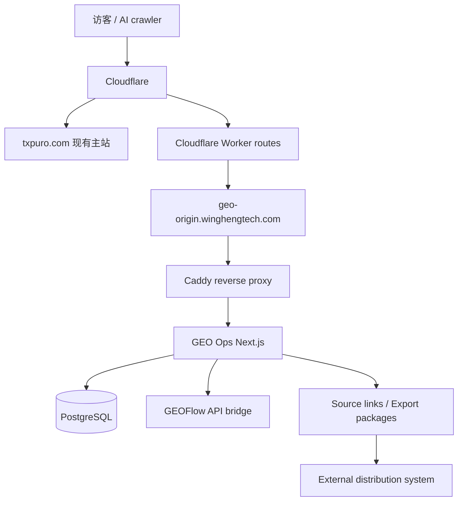

# GEO Ops 系统总手册

Last updated: 2026-08-01

## 1. 系统定位

这套系统不是单一官网，也不是单一内容工具，而是一套围绕 `GEO / AEO / AI Search` 运营的内容情报、生成与源站输出系统。

当前系统可以做“分发”，但分发方式是发布为当前系统自己的公开 URL 和标准化内容包，不直接承担社媒账号连接、OAuth、排期发布和平台风控。外部专门的分发系统负责把这些链接和内容包发布到指定平台账号。

当前实际组成：

- `wingheng.technology`
  内部 GEO Ops 后台，总控台
- `txpuro.com/guides/*`
  对外 GEO 内容区，由当前系统承载
- `txpuro.com`
  现有产品主站，不由本仓库接管
- `geo-origin.winghengtech.com`
  给 Cloudflare 路径代理使用的专用源站入口

## 2. 当前线上拓扑



说明：

- `txpuro.com` 主站继续跑现有系统
- 只有下面这些 path 被 Cloudflare Worker 转到当前 GEO 系统：
  - `/guides`
  - `/guides/*`
  - `/llms.txt`
  - `/sitemap-guides.xml`
- GEO Ops 内部后台仍然挂在 `wingheng.technology`
- 当前系统输出 `txpuro.com/guides/*` 公开链接和后续 `ExportPackage` 内容包，外部分发系统负责发到具体平台账号

## 3. 域名与入口

### 3.1 内部后台

- `https://wingheng.technology`

特点：

- Better Auth 会话保护；未登录访问内部页面会跳转到 `/login`
- 内部 API 从会话解析租户范围和角色；公开品牌页面不要求会话
- 用于内容资产、GEO audit、GEOFlow、Postiz 管理

### 3.2 对外 GEO 内容区

- `https://txpuro.com/guides`
- `https://txpuro.com/guides/*`
- `https://txpuro.com/llms.txt`
- `https://txpuro.com/sitemap-guides.xml`

特点：

- 面向搜索引擎、AI crawler、外部访客公开
- canonical 固定落在 `txpuro.com`
- 页面内容由本系统直接输出

### 3.3 专用源站

- `https://geo-origin.winghengtech.com`

特点：

- 不作为对外品牌入口
- 仅作为 Cloudflare Worker 回源目标
- 当前已经可正常提供 HTTPS

## 4. 系统模块

### 4.1 GEO Ops

职责：

- 内容资产 `ContentAsset`
- GEO brief
- GEO audit
- 渠道变体 `ChannelVariant`
- GEOFlow 发送与同步
- Source links / Export packages
- Distribution status callback
- 系统健康检查与操作审计

核心页面：

- Overview
- Assets
- GEO Runs
- Channels
- Settings

### 4.2 Txpuro Guides 内容层

职责：

- 承载 GEO 内容页
- 输出结构化页面、FAQ、对比页、功能页
- 输出 `llms.txt`
- 输出 `sitemap-guides.xml`
- 承接主站导流流量

### 4.3 GEOFlow Bridge

职责：

- 向 GEOFlow 创建任务
- 入队生成内容
- 轮询同步文章状态
- 回写 published article URL 到内容资产

### 4.4 Source Links / Export Packages

职责：

- 将内容发布为当前系统源站 URL
- 输出可被下游系统读取的内容包
- 记录外部分发系统回传的发布状态
- Postiz 如继续使用，只作为可选下游分发系统之一，不再是当前系统核心模块

## 5. 数据模型

### 5.1 ContentAsset

内容主档。

当前已经支持：

- 标题、正文、摘要
- 品牌实体
- 来源 URL
- 关键词
- canonical URL
- 状态
- GEO 分数
- slug
- locale
- assetType
- audience
- seoTitle
- metaDescription
- faqs
- schemaType
- ctaMode
- publishTarget
- isPublic
- publishedPath

### 5.2 GeoRun

GEO 审计结果。

保存：

- provider
- prompt
- locale
- score
- answer
- cited domains
- recommendations
- contentAssetId

### 5.3 ChannelVariant

渠道版本。

保存：

- contentAssetId
- platform
- copy
- mediaAssets
- scheduledAt
- status

### 5.4 GeoFlowTaskLink

GEO Ops 资产和 GEOFlow task/article 的映射。

### 5.5 AuditEvent

关键写入动作的审计记录。

## 6. 当前 Txpuro 内容结构

### 6.1 首页

- `/guides`

### 6.2 功能与商业页

- `/guides/pricing`
- `/guides/features`
- `/guides/features/myinvois-integration`
- `/guides/features/bulk-import`
- `/guides/features/email-whatsapp-delivery`
- `/guides/features/credit-note-debit-note-vs-void`
- `/guides/features/bilingual-interface`
- `/guides/features/api-integration`

### 6.3 指南页

- `/guides/what-is-myinvois`
- `/guides/malaysia-einvoice-implementation-timeline`
- `/guides/how-to-start-einvoice-for-sme`
- `/guides/self-billed-einvoice-malaysia`
- `/guides/credit-note-vs-debit-note-vs-void`
- `/guides/einvoice-api-vs-portal`

### 6.4 对比页

- `/guides/compare/txpuro-vs-myinvois-portal`
- `/guides/compare/txpuro-vs-manual-process`
- `/guides/compare/txpuro-vs-custom-build`

### 6.5 说明页

- `/guides/faq`
- `/guides/about`
- `/guides/contact`
- `/guides/security`
- `/guides/implementation-support`

## 7. Cloudflare 当前落法

当前正式可用的方式是 **Workers Routes**，不是 Page Rules，也不是当前套餐下受限的 Origin Rules override。

### 7.1 Worker 作用

只接管这些 path：

- `txpuro.com/guides`
- `txpuro.com/guides/*`
- `txpuro.com/llms.txt`
- `txpuro.com/sitemap-guides.xml`

可选同步接管：

- `www.txpuro.com/guides`
- `www.txpuro.com/guides/*`
- `www.txpuro.com/llms.txt`
- `www.txpuro.com/sitemap-guides.xml`

### 7.2 Worker 回源目标

- `geo-origin.winghengtech.com`

### 7.3 为什么不用 Page Rules

因为 Page Rules 更适合做：

- 跳转
- 缓存
- 边缘参数

不适合做当前这种 path 级反向代理回源。

## 8. 安全控制

### 8.1 后台

- Better Auth session
- `workspace_internal` 成员范围和角色检查
- 安全头

角色：

- `Admin`：创建 client、注册 site integration，以及所有有范围的管理操作。
- `Operator`：在已获 client 范围内创建 brand、site 和 market。
- `Reviewer`、`Viewer`：不能创建上述组织资源。

### 8.2 内部接口

- 除 `/api/healthz`、Better Auth 路由和 signed worker contract 外，内部 API 必须有有效 Better Auth 会话。
- 用户发起的 API 根据 session membership 建立 client scope；跨 client 或越权角色返回 `403`，未登录返回 `401`。
- `/api/internal/content-generate` 是 signed worker-to-platform contract，使用 `/run/secrets/sgeo_internal_secret`，不使用用户会话；`geo-worker` 不持有 `DATABASE_URL`。
- `POST /api/internal/analysis-runs/:runId/search-console/credential` 只在签名、body 和完整 run/client/brand/site/integration/property scope 同时匹配时，通过 `Integration.secretRef` 与 `FileSecretResolver` 返回访问 token；响应禁止缓存，禁用、缺失 secret 和跨 scope 统一为非枚举失败。
- `POST /api/internal/analysis-runs/:runId/search-console/auth-failure` 在同一 owned scope 内以事务禁用唯一的 `type=search_console` Integration，并用确定性 ID 幂等 upsert 当前 AnalysisRun 的 operator Recommendation。两个 Search Console contract 都不记录 token，worker payload、Trigger metadata 和 raw artifact 也不得包含 token。
- `POST /api/internal/analysis-runs/search-console/dispatch` 接受签名的 Trigger scheduled timestamp，按 `America/Los_Angeles` 日历回退 3 天，只枚举 active owner/site 下启用且配置安全 file secret 与合法 property 的 Search Console Integration，并以 integration/date 幂等创建 AnalysisRun 与 `analysis_run.created` outbox event。返回值只包含严格的 run/client/brand/site/integration/property/date scope。
- `search-console-daily-dispatch` 以 `0 4 * * *` 注册 Trigger declarative schedule，调用上述控制面后使用 runId 作为 Trigger idempotency key 批量触发 `search-console-sync`；daily 与 sync worker 均不连接数据库。
- `POST /api/internal/analysis-runs/:runId/matomo/credential` 只接受签名且完整匹配 run/client/brand/site/site-market/integration/canonical-endpoint 的 scope。它通过启用状态的 `type=matomo` Integration、`secretRef` 和 `FileSecretResolver` 取 token，响应设置 `no-store`；跨 client、禁用 integration、unsafe file reference 与缺失 secret 使用同一非枚举失败。
- `POST /api/internal/analysis-runs/:runId/matomo/auth-failure` 在同一 owned scope 内事务禁用唯一 Integration，并以 run/integration digest 生成确定性 Recommendation ID。畸形 JSON 仍须先核对已读取 body 的 HMAC digest，不能在认证前进入控制面。
- `matomo-sync` payload 只含 owned scope、canonical Matomo origin、最多 366 天的日期、`idSite`、segment、IANA timezone、`idGoal` 与 bounded goal name，不含 token。worker 只通过 signed control route 取 token，并只把 token 放进 Matomo Reporting API POST body；raw response 先上传 artifact，再 checkpoint 和 ingest，worker 不连接业务数据库。
- `GET /api/sites/:siteId/seo` 只接受 `start`、`end` 和可选 `siteMarketId`。日期是严格 `YYYY-MM-DD` calendar date、最多 366 个包含首尾的日历日；重复或额外参数返回 `400`。client/brand 永远从 session 可访问的 site relationship 推导，missing、cross-client 和 inconsistent market 使用相同 `404`。省略或提交空 `siteMarketId` 表示严格 site-level run，不扩大到所有 markets。
- SEO report 的 `baseline` 是窗口内 supported source 中最早完成的 `succeeded`/`partial` AnalysisRun，`latest` 是最晚完成的同类 run；两者以 `finishedAt`、再以 run ID 确定性排序。它们是 report-window anchors，不代表单一 source 覆盖全部 metrics。每个 metric 只按相同 name、definition 和 aggregation 计算自己的 value/delta，并返回独立 source run IDs 与 comparison status。run history 最多返回 50 条，响应不包含 artifact URI、raw observation value、integration secret 或 token。

### 8.3 健康检查

- `GET /api/healthz`

用途：

- Docker healthcheck
- 反向代理探活

## 9. 运维位置

服务器：

- `47.239.166.249`

应用目录：

- `/opt/geo-content-ops`

关键文件：

- `/opt/geo-content-ops/.env`
- `/opt/geo-content-ops/deploy/docker-compose.prod.example.yml`
- `/opt/geo-content-ops/deploy/Caddyfile.example`

备份目录：

- `/opt/geo-content-ops/backups`

## 10. 常用命令

### 10.1 查看容器

```bash
cd /opt/geo-content-ops
docker compose --env-file .env -f deploy/docker-compose.prod.example.yml ps
```

### 10.2 查看日志

```bash
cd /opt/geo-content-ops
docker compose --env-file .env -f deploy/docker-compose.prod.example.yml logs -f geo-ops
docker compose --env-file .env -f deploy/docker-compose.prod.example.yml logs -f reverse-proxy
```

### 10.3 重新部署

```powershell
.\deploy\remote-deploy.ps1 -HostName 47.239.166.249 -User root -KeyPath "$env:USERPROFILE\.ssh\geo_ops_deploy_ed25519"
```

### 10.4 备份数据库

```bash
cd /opt/geo-content-ops
APP_DIR=/opt/geo-content-ops RETENTION_DAYS=14 bash deploy/backup-postgres.sh
```

## 11. Phase 1 平台基础运维

以下命令以生产应用目录 `/opt/geo-content-ops` 为例。生产命令都使用同一 Compose 调用：

```bash
docker compose --env-file .env -f deploy/docker-compose.prod.example.yml
```

先准备未跟踪的 `.env`，其中必须有 `DATABASE_URL`、`POSTGRES_PASSWORD`、`BETTER_AUTH_SECRET`（至少 32 个字符）和 `BETTER_AUTH_URL`。部署归档不会传输 `.env` 或 `secrets/`。在目标主机带外 provision 下列文件，绝不把内容写进文档、shell history 或 Git：

```bash
cd /opt/geo-content-ops
install -d -o root -g 10001 -m 0750 secrets
# 通过受控 SSH 或 secret manager 放入 secrets/sgeo_internal_secret。
chown root:10001 secrets/sgeo_internal_secret
chmod 0640 secrets/sgeo_internal_secret
```

生产 Compose 将该目录只读挂载给 `geo-ops`，并将 artifact named volume 挂载为 `/var/lib/sgeo/artifacts`。它不启动 `geo-worker`；单独 provision 的 Trigger worker 只能使用 `SGEO_INTERNAL_URL` 和 `SGEO_INTERNAL_SECRET_FILE` 与平台交互，绝不设置 `DATABASE_URL`。production worker runbook 在 [Trigger.dev v4 Production Precondition](../deploy/README.md#triggerdev-v4-production-precondition) 所述的 Phase 2 Task 9 交付前不可假定已经部署。

### 11.1 创建首位管理员

先启动 PostgreSQL 并执行全部 Prisma migration；`workspace_internal` 必须已存在。bootstrap 只能在 user 表为空时运行，重复执行会返回 `BOOTSTRAP_ALREADY_COMPLETED`。

```bash
cd /opt/geo-content-ops
docker compose --env-file .env -f deploy/docker-compose.prod.example.yml up -d postgres
docker compose --env-file .env -f deploy/docker-compose.prod.example.yml run --rm geo-ops npm run prisma:deploy

read -r -p 'Admin email: ' SGEO_BOOTSTRAP_ADMIN_EMAIL
read -r -p 'Admin name: ' SGEO_BOOTSTRAP_ADMIN_NAME
read -r -s -p 'Admin password: ' SGEO_BOOTSTRAP_ADMIN_PASSWORD
printf '\n'
export SGEO_BOOTSTRAP_ADMIN_EMAIL SGEO_BOOTSTRAP_ADMIN_NAME SGEO_BOOTSTRAP_ADMIN_PASSWORD
docker compose --env-file .env -f deploy/docker-compose.prod.example.yml run --rm \
  -e SGEO_BOOTSTRAP_ADMIN_EMAIL \
  -e SGEO_BOOTSTRAP_ADMIN_NAME \
  -e SGEO_BOOTSTRAP_ADMIN_PASSWORD \
  geo-ops npm run auth:bootstrap
unset SGEO_BOOTSTRAP_ADMIN_EMAIL SGEO_BOOTSTRAP_ADMIN_NAME SGEO_BOOTSTRAP_ADMIN_PASSWORD
```

登录页使用 Better Auth email/password。不要打开常规 signup；bootstrap 脚本仅在该次命令内开启 signup 并创建 `Admin` membership。

### 11.2 创建 client、brand、site 和 market

在受保护的管理客户端中登录后，使用该会话调用 API。下面的 `BETTER_AUTH_SESSION_COOKIE` 只应在当前 shell 从安全来源设置，并在完成后 `unset`；不要把 cookie 写入脚本、history 或提交文件。先创建 client，再从响应依次取 `client.id`、`brand.id` 和 `site.id`。

```bash
OPS_URL='https://wingheng.technology'
read -r -s -p 'Better Auth session cookie: ' BETTER_AUTH_SESSION_COOKIE
printf '\n'

curl --fail-with-body -sS -X POST "$OPS_URL/api/clients" \
  -H 'content-type: application/json' \
  -H "cookie: $BETTER_AUTH_SESSION_COOKIE" \
  --data '{"name":"Example Client","slug":"example-client","active":true}'

curl --fail-with-body -sS -X POST "$OPS_URL/api/clients/<client-id>/brands" \
  -H 'content-type: application/json' \
  -H "cookie: $BETTER_AUTH_SESSION_COOKIE" \
  --data '{"name":"Example Brand","slug":"example-brand","aliases":[],"products":null,"industry":null,"goals":null,"riskCategory":"standard"}'

curl --fail-with-body -sS -X POST "$OPS_URL/api/brands/<brand-id>/sites" \
  -H 'content-type: application/json' \
  -H "cookie: $BETTER_AUTH_SESSION_COOKIE" \
  --data '{"name":"Example Site","canonicalHost":"www.example.com","originHosts":["origin.example.com"],"siteType":"content","hostingMode":"hosted","canonicalRules":{"https":true},"allowedPublishPaths":["/guides"],"active":true}'

curl --fail-with-body -sS -X POST "$OPS_URL/api/sites/<site-id>/markets" \
  -H 'content-type: application/json' \
  -H "cookie: $BETTER_AUTH_SESSION_COOKIE" \
  --data '{"country":"MY","locale":"en-MY","defaultDevice":"desktop","timezone":"Asia/Kuala_Lumpur","settings":null}'

unset BETTER_AUTH_SESSION_COOKIE
```

创建 client 需要 `Admin`。创建 brand、site、market 需要 `Admin` 或 `Operator`，且 session scope 必须包含对应 client。host 只能是 host[:port]，不能包含 scheme、path、query 或 credentials；API 会规范化大小写和尾随点，但会丢弃 port。canonical host claim 不包含 port，因此不要依赖 `example.com:443` 与 `example.com:8443` 区分两个 site；使用不同 hostname。重复 host claim 返回 `409`。

### 11.3 注册 file-based secret reference

先在目标主机的 `secrets/` 下带外放置 integration secret。reference 相对 `SGEO_SECRET_ROOT=/run/secrets`；只能使用 `file:<relative-path>`，不能使用绝对路径、`..` 或符号链接逃逸。API 只保存 reference，并仅返回 `secretConfigured`，不会返回 secret。

```bash
cd /opt/geo-content-ops
install -d -m 700 secrets/integrations
# 通过 secret manager 或受控文件传输写入 secrets/integrations/geoflow_token。
chmod 600 secrets/integrations/geoflow_token

OPS_URL='https://wingheng.technology'
read -r -s -p 'Better Auth session cookie: ' BETTER_AUTH_SESSION_COOKIE
printf '\n'

curl --fail-with-body -sS -X POST "$OPS_URL/api/sites/<site-id>/integrations" \
  -H 'content-type: application/json' \
  -H "cookie: $BETTER_AUTH_SESSION_COOKIE" \
  --data '{"siteMarketId":"<site-market-id>","type":"geoflow","endpoint":"https://geoflow.example.com","capabilities":["tasks:read","tasks:write"],"adapterVersion":"v1","secretRef":"file:integrations/geoflow_token"}'

unset BETTER_AUTH_SESSION_COOKIE
```

此操作需要 `Admin` 和目标 site 的 client scope。使用 `GET /api/sites/<site-id>/integrations` 核对已注册的 integration；不要尝试从 API 读取 secret。

Matomo integration 的 endpoint 必须是 origin-only，例如 `https://analytics.example.com`；API 会把尾随 `/`、默认 port 和 host 大小写规范化后再存储。path、query、fragment 和 userinfo 会被拒绝。将只读 Reporting API token 放在 `SGEO_SECRET_ROOT` 下的受限文件中，然后注册：

```bash
install -d -m 700 secrets/integrations/matomo
# 通过受控 secret channel 写入 secrets/integrations/matomo/reporting_token。
chmod 600 secrets/integrations/matomo/reporting_token

curl --fail-with-body -sS -X POST "$OPS_URL/api/sites/<site-id>/integrations" \
  -H 'content-type: application/json' \
  -H "cookie: $BETTER_AUTH_SESSION_COOKIE" \
  --data '{"siteMarketId":"<site-market-id>","type":"matomo","endpoint":"https://analytics.example.com/","capabilities":["reporting"],"adapterVersion":"1.0.0","secretRef":"file:integrations/matomo/reporting_token"}'
```

Matomo task 运行时还必须由受信任控制面提供匹配该 Matomo site 的 `idSite`、`idGoal`、goal name、segment、timezone 和 date range；不要把 `token_auth` 放进 payload、Trigger metadata、日志或 artifact。

### 11.4 migration expand、backfill 和 contract 检查

生产部署只应用 migration，不使用 `prisma migrate dev`、`prisma migrate reset` 或手工修改 `_prisma_migrations`：

```bash
cd /opt/geo-content-ops
docker compose --env-file .env -f deploy/docker-compose.prod.example.yml up -d postgres
docker compose --env-file .env -f deploy/docker-compose.prod.example.yml run --rm geo-ops npm run prisma:deploy
docker compose --env-file .env -f deploy/docker-compose.prod.example.yml run --rm geo-ops npx prisma migrate status
```

Phase 1 ownership sequence is `20260731090000_platform_foundation_expand`、`20260731100000_backfill_txpuro_ownership`、`20260731110000_enforce_platform_scope` 和 `20260731120000_remove_legacy_ownership_defaults`。backfill 在 transaction 中锁住 legacy tables；contract migration 会在发现无 root ownership 的记录时中止。先修复该数据或从备份恢复，不能跳过 migration。

在专用非生产 PostgreSQL 16 实例上创建 disposable database `sgeo_task4_test`，或使用安全后缀如 `sgeo_task4_test_task12`。测试用户必须能创建和删除 schema。Txpuro backfill guard 只接受 `sgeo_task4_test` 或以 `sgeo_task4_test_` 开头的 database；任意名称如 `sgeo_test` 会被 guard 拒绝。绝不能指向生产或共享业务 database。

```bash
export TEST_DATABASE_URL='postgresql://<non-production-test-user>:<non-production-test-password>@127.0.0.1:5432/sgeo_task4_test?schema=public'
npm run test:integration -- \
  tests/integration/client-isolation.test.ts \
  tests/integration/txpuro-backfill.test.ts \
  tests/integration/compose-policy.test.ts
unset TEST_DATABASE_URL
```

`npm run test:integration` 固定使用 `vitest.integration.config.ts`，该 config 已启用 database coverage。`TEST_DATABASE_URL` 是实际前置条件；缺少它时，database-backed integration suites 会明确报该前置条件并使该命令退出非零。应记录为外部测试服务缺失，不能把它记录为通过，也不要将生产 `DATABASE_URL` 作为替代。

### 11.5 恢复 PostgreSQL 与 artifacts

`deploy/backup-postgres.sh` 生成 plain SQL gzip backup。只将同一恢复点的 database archive 与 artifact archive 配对使用。以下 Bash procedure 先验证所选 archive，再在替换前创建并验证当前 database 的 safety backup；任何 preflight 失败时都不要停止服务、drop database 或继续恢复。

```bash
cd /opt/geo-content-ops
set -euo pipefail
BACKUP_DIR=/opt/geo-content-ops/backups
BACKUP=/opt/geo-content-ops/backups/geo_content_ops-YYYYMMDD-HHMMSS.sql.gz
test -r "$BACKUP"
gzip -t "$BACKUP"

RESTORE_ID="$(date +%Y%m%d-%H%M%S)"
PRE_RESTORE_DIR="$BACKUP_DIR/pre-restore-$RESTORE_ID"
APP_DIR=/opt/geo-content-ops BACKUP_DIR="$PRE_RESTORE_DIR" \
  bash deploy/backup-postgres.sh
PRE_RESTORE_BACKUP="$(find "$PRE_RESTORE_DIR" -maxdepth 1 -type f -name 'geo_content_ops-*.sql.gz' -print -quit)"
test -n "$PRE_RESTORE_BACKUP"
gzip -t "$PRE_RESTORE_BACKUP"

docker compose --env-file .env -f deploy/docker-compose.prod.example.yml stop geo-ops
docker compose --env-file .env -f deploy/docker-compose.prod.example.yml up -d postgres
docker compose --env-file .env -f deploy/docker-compose.prod.example.yml exec -T postgres sh -ceu \
  'dropdb -U "$POSTGRES_USER" --if-exists "$POSTGRES_DB"; createdb -U "$POSTGRES_USER" "$POSTGRES_DB"'
gzip -dc "$BACKUP" | \
  docker compose --env-file .env -f deploy/docker-compose.prod.example.yml exec -T postgres sh -ceu \
    'exec psql -v ON_ERROR_STOP=1 -U "$POSTGRES_USER" -d "$POSTGRES_DB"'
```

`set -euo pipefail` 使 `gzip` 或 `psql` 任一失败都让 restore command 失败，不能把截断解压当作成功。preflight 或 safety backup 失败时 live database 尚未改动，停止并修复 archive 或 backup storage。drop/create/restore 中任何一步失败时，保持 `geo-ops` 停止，不要运行 migration 或启动应用；用已验证的 `$PRE_RESTORE_BACKUP` 作为 `BACKUP` 重跑同一 procedure，直到 database 完整恢复。

artifact archive 也必须先验证。此 procedure 在停写后创建独立 rollback archive，将 candidate 解压到 `artifact-data` volume 内的 staging directory，验证后才移动 live entries。不要执行 `docker compose down -v`。

```bash
cd /opt/geo-content-ops
set -euo pipefail
BACKUP_DIR=/opt/geo-content-ops/backups
ARTIFACT_BACKUP=/opt/geo-content-ops/backups/artifacts-YYYYMMDD-HHMMSS.tar.gz
test -r "$ARTIFACT_BACKUP"
tar -tzf "$ARTIFACT_BACKUP" >/dev/null

RESTORE_ID="$(date +%Y%m%d-%H%M%S)"
ARTIFACT_BACKUP_NAME="$(basename "$ARTIFACT_BACKUP")"
ARTIFACT_ROLLBACK="$BACKUP_DIR/artifacts-pre-restore-$RESTORE_ID.tar.gz"
if tar -tzf "$ARTIFACT_BACKUP" | grep -c '/metadata.json$' >/dev/null; then
  # 从所选 archive 内一个已知 metadata.json 读取 artifact:// URI；不含 secret。
  read -r -p 'Representative artifact URI: ' VERIFY_ARTIFACT_URI
  case "$VERIFY_ARTIFACT_URI" in
    artifact://*/*) ;;
    *) echo 'A canonical artifact://<run-id>/<name> URI is required.' >&2; exit 2 ;;
  esac
else
  VERIFY_ARTIFACT_URI=''
  printf 'Selected artifact archive has no metadata.json; record the no-artifact exception.\n' >&2
fi

docker compose --env-file .env -f deploy/docker-compose.prod.example.yml stop geo-ops
docker compose --env-file .env -f deploy/docker-compose.prod.example.yml run --rm --no-deps -T geo-ops \
  sh -ceu 'tar -C "$SGEO_ARTIFACT_ROOT" -czf - .' > "$ARTIFACT_ROLLBACK"
chmod 600 "$ARTIFACT_ROLLBACK"
tar -tzf "$ARTIFACT_ROLLBACK" >/dev/null

docker compose --env-file .env -f deploy/docker-compose.prod.example.yml run --rm --no-deps -T \
  -v "$BACKUP_DIR":/backup:ro \
  -e ARTIFACT_BACKUP_NAME="$ARTIFACT_BACKUP_NAME" \
  -e RESTORE_ID="$RESTORE_ID" \
  geo-ops sh -ceu '
    root="$SGEO_ARTIFACT_ROOT"
    stage_name=".restore-stage-$RESTORE_ID"
    previous_name=".restore-previous-$RESTORE_ID"
    stage="$root/$stage_name"
    previous="$root/$previous_name"
    test ! -e "$stage"
    test ! -e "$previous"
    mkdir -m 700 "$stage"
    tar -xzf "/backup/$ARTIFACT_BACKUP_NAME" -C "$stage"
    test -d "$stage"
    stage_symlink="$(find "$stage" -type l -print -quit)"
    if [ -n "$stage_symlink" ]; then
      echo "Refusing artifact archive containing symlinks" >&2
      exit 1
    fi
    mkdir -m 700 "$previous"
    find "$root" -mindepth 1 -maxdepth 1 \
      ! -name "$stage_name" ! -name "$previous_name" \
      -exec mv -- {} "$previous"/ \;
    find "$stage" -mindepth 1 -maxdepth 1 -exec mv -- {} "$root"/ \;
    rmdir "$stage"
  '

stop_after_switch_failure() {
  status=$?
  trap - ERR
  docker compose --env-file .env -f deploy/docker-compose.prod.example.yml \
    stop geo-ops || true
  printf 'Post-switch platform verification failed; geo-ops stopped. Keep .restore-previous-%s and %s for recovery.\n' \
    "$RESTORE_ID" "$ARTIFACT_ROLLBACK" >&2
  exit "$status"
}
trap stop_after_switch_failure ERR

docker compose --env-file .env -f deploy/docker-compose.prod.example.yml up -d geo-ops
health_ready=0
attempt=1
while [ "$attempt" -le 30 ]; do
  if docker compose --env-file .env -f deploy/docker-compose.prod.example.yml \
    exec -T geo-ops node -e \
      'fetch("http://127.0.0.1:3000/api/healthz").then((response) => process.exit(response.ok ? 0 : 1)).catch(() => process.exit(1))'
  then
    health_ready=1
    break
  fi
  attempt=$((attempt + 1))
  sleep 2
done
test "$health_ready" -eq 1

if [ -n "$VERIFY_ARTIFACT_URI" ]; then
  docker compose --env-file .env -f deploy/docker-compose.prod.example.yml \
    exec -T geo-ops node --input-type=module -e '
      import { createHash } from "node:crypto";
      import { readFile } from "node:fs/promises";
      import { join } from "node:path";

      const [uri] = process.argv.slice(1);
      const root = process.env.SGEO_ARTIFACT_ROOT;
      if (!uri || !root) throw new Error("ARTIFACT_VERIFY_INPUT_REQUIRED");
      const objectName = `artifact-${createHash("sha256").update(uri).digest("hex")}`;
      const objectPath = join(root, objectName);
      const metadata = JSON.parse(await readFile(join(objectPath, "metadata.json"), "utf8"));
      const payload = await readFile(join(objectPath, "payload"));
      const checksum = `sha256:${createHash("sha256").update(payload).digest("hex")}`;
      if (metadata.version !== 1 || metadata.uri !== uri || metadata.byteSize !== payload.byteLength || metadata.checksum !== checksum) {
        throw new Error("ARTIFACT_READ_VERIFICATION_FAILED");
      }
      console.log(`Verified ${uri}`);
    ' "$VERIFY_ARTIFACT_URI"
fi

trap - ERR
printf 'Platform validation passed for the production Compose stack.\n'
```

`geo-ops` 启动后最多等待 60 秒（30 次、每次 2 秒），使用 Compose healthcheck 同一 Node `fetch` contract 验证 `/api/healthz`。artifact verification 以 `metadata.json` 的 canonical URI 定位其 SHA-256 physical object，读取 `payload` 并比对 metadata 的 version、URI、byte size 和 checksum，不依赖不存在的 public artifact endpoint。若所选 archive 没有 `metadata.json`，procedure 会记录 no-artifact exception，不执行 read verification；在恢复记录中注明该条件，且不要声称已完成 artifact read。

当前 production Compose 不定义 `geo-worker`，因此本 procedure 只恢复并验证 `geo-ops`。如另行 provision 了 Trigger worker，database/artifact restore 前后的 quiesce 和 recovery 必须由其 deployment owner 在独立环境中协调。遵循 [Trigger.dev v4 Production Precondition](../deploy/README.md#triggerdev-v4-production-precondition)；具体 self-host production runbook 在 Phase 2 Task 9 交付前不可假定已经部署。

selected archive preflight 失败时，不要停止服务或修改 live artifacts；修复或更换 archive 后从头运行。staging extraction 失败时，live artifact entries 尚未移动；保持 `geo-ops` 停止，删除仅 `.restore-stage-$RESTORE_ID`，保留 `$ARTIFACT_ROLLBACK`，再选择 archive 重试。switch、platform health/read 任一步失败时，`ERR` trap 会停止 `geo-ops`，并保留 `.restore-previous-$RESTORE_ID` 与 `$ARTIFACT_ROLLBACK`；不要手动启动服务，使用 rollback archive 重跑 staging procedure。成功恢复后，再清理 volume 内的 previous directory：

```bash
docker compose --env-file .env -f deploy/docker-compose.prod.example.yml run --rm --no-deps -T \
  -e RESTORE_ID="$RESTORE_ID" geo-ops sh -ceu '
    previous="$SGEO_ARTIFACT_ROOT/.restore-previous-$RESTORE_ID"
    test -d "$previous"
    rm -rf -- "$previous"
  '
```

`$ARTIFACT_ROLLBACK` 不会被 `backup-postgres.sh` 自动清理；至少保留到与之配对的 database backup 的 retention window 结束，再由受控 backup rotation 删除。`LocalArtifactStore` 在读取时校验 metadata、payload 和 checksum；恢复后出现 `ARTIFACT_CORRUPT` 必须从原始 archive 重新恢复，不能手改 object files 或 checksum。

### 11.6 回滚应用，不删除新 schema

先确认目标旧应用版本可读取当前 schema。若不能兼容，恢复与该应用 release 匹配的 PostgreSQL 和 artifact backup，而不是删除新 columns、tables、migration records 或 named volumes。

部署脚本会把本地 checkout 打包到服务器，且默认不运行 migration。用隔离的本地 release checkout 切换到已验证 commit，再执行脚本时不要传 `-RunMigrations`：

```powershell
git switch --detach <known-good-application-commit>
.\deploy\remote-deploy.ps1 -HostName <host> -User <user> -KeyPath <key>
git switch -
```

在服务器验证 healthcheck 与容器状态：

```bash
curl -fsS http://127.0.0.1/api/healthz
docker compose --env-file .env -f deploy/docker-compose.prod.example.yml ps
```

## 12. 当前系统使用流程

1. 在 `wingheng.technology` 登录后台
2. 创建或编辑 `ContentAsset`
3. 生成 GEO brief
4. 跑 GEO audit
5. 如需长文生产，发送到 GEOFlow
6. 发布成功后同步 GEOFlow 状态
7. 发布为当前系统源站 URL，或生成可分发内容包
8. 外部分发系统通过 URL/API 拉取内容并发布到指定平台
9. 外部分发系统回传发布状态
10. 对外流量通过主站、AI 搜索或分发平台进入 `txpuro.com/guides/*`

## 13. 当前文档清单

- [wingheng-local-ops-index.md](./wingheng-local-ops-index.md)
- [system-reference.md](./system-reference.md)
- [system-sop.md](./system-sop.md)
- [architecture.md](./architecture.md)
- [server-47.239.166.249-deployment.md](./server-47.239.166.249-deployment.md)
- [geoflow-rollout.md](./geoflow-rollout.md)
- [txpuro-geo-strategy.md](./txpuro-geo-strategy.md)
- [txpuro-main-site-entry-plan.md](./txpuro-main-site-entry-plan.md)
- [content-source-and-distribution-boundary.md](./content-source-and-distribution-boundary.md)
- [database-design-v2.md](./database-design-v2.md)
- [distribution-api-contract-v1.md](./distribution-api-contract-v1.md)
