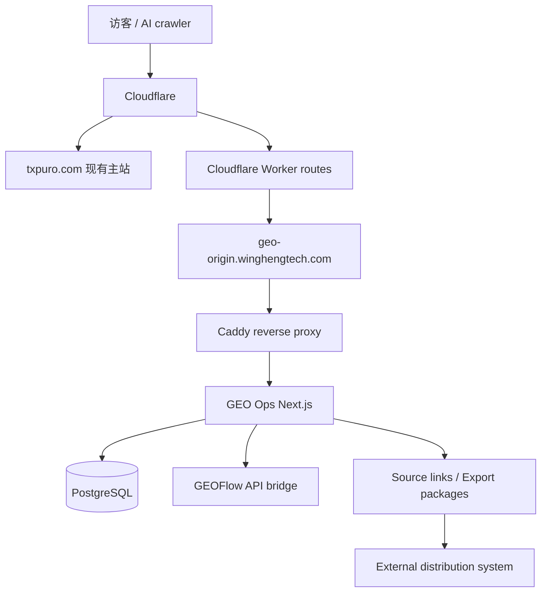

# GEO Ops 系统总手册

Last updated: 2026-08-01

## 1. 系统定位

这套系统不是单一官网，也不是单一内容工具，而是一套围绕 `GEO / AEO / AI Search` 运营的内容情报、生成与源站输出系统。

当前系统可以做“分发”，但分发方式是发布为当前系统自己的公开 URL 和标准化内容包，不直接承担社媒账号连接、OAuth、排期发布和平台风控。外部专门的分发系统负责把这些链接和内容包发布到指定平台账号。

当前实际组成：

- `wingheng.technology`
  内部 GEO Ops 后台，总控台
- `txpuro.com/guides/*`
  对外 GEO 内容区，由当前系统承载
- `txpuro.com`
  现有产品主站，不由本仓库接管
- `geo-origin.winghengtech.com`
  给 Cloudflare 路径代理使用的专用源站入口

## 2. 当前线上拓扑



说明：

- `txpuro.com` 主站继续跑现有系统
- 只有下面这些 path 被 Cloudflare Worker 转到当前 GEO 系统：
  - `/guides`
  - `/guides/*`
  - `/llms.txt`
  - `/sitemap-guides.xml`
- GEO Ops 内部后台仍然挂在 `wingheng.technology`
- 当前系统输出 `txpuro.com/guides/*` 公开链接和后续 `ExportPackage` 内容包，外部分发系统负责发到具体平台账号

## 3. 域名与入口

### 3.1 内部后台

- `https://wingheng.technology`

特点：

- Better Auth 会话保护；未登录访问内部页面会跳转到 `/login`
- 内部 API 从会话解析租户范围和角色；公开品牌页面不要求会话
- 用于内容资产、GEO audit、GEOFlow、Postiz 管理

### 3.2 对外 GEO 内容区

- `https://txpuro.com/guides`
- `https://txpuro.com/guides/*`
- `https://txpuro.com/llms.txt`
- `https://txpuro.com/sitemap-guides.xml`

特点：

- 面向搜索引擎、AI crawler、外部访客公开
- canonical 固定落在 `txpuro.com`
- 页面内容由本系统直接输出

### 3.3 专用源站

- `https://geo-origin.winghengtech.com`

特点：

- 不作为对外品牌入口
- 仅作为 Cloudflare Worker 回源目标
- 当前已经可正常提供 HTTPS

## 4. 系统模块

### 4.1 GEO Ops

职责：

- 内容资产 `ContentAsset`
- GEO brief
- GEO audit
- 渠道变体 `ChannelVariant`
- GEOFlow 发送与同步
- Source links / Export packages
- Distribution status callback
- 系统健康检查与操作审计

核心页面：

- Overview
- Assets
- GEO Runs
- Channels
- Settings

### 4.2 Txpuro Guides 内容层

职责：

- 承载 GEO 内容页
- 输出结构化页面、FAQ、对比页、功能页
- 输出 `llms.txt`
- 输出 `sitemap-guides.xml`
- 承接主站导流流量

### 4.3 GEOFlow Bridge

职责：

- 向 GEOFlow 创建任务
- 入队生成内容
- 轮询同步文章状态
- 回写 published article URL 到内容资产

### 4.4 Source Links / Export Packages

职责：

- 将内容发布为当前系统源站 URL
- 输出可被下游系统读取的内容包
- 记录外部分发系统回传的发布状态
- Postiz 如继续使用，只作为可选下游分发系统之一，不再是当前系统核心模块

## 5. 数据模型

### 5.1 ContentAsset

内容主档。

当前已经支持：

- 标题、正文、摘要
- 品牌实体
- 来源 URL
- 关键词
- canonical URL
- 状态
- GEO 分数
- slug
- locale
- assetType
- audience
- seoTitle
- metaDescription
- faqs
- schemaType
- ctaMode
- publishTarget
- isPublic
- publishedPath

### 5.2 GeoRun

GEO 审计结果。

保存：

- provider
- prompt
- locale
- score
- answer
- cited domains
- recommendations
- contentAssetId

### 5.3 ChannelVariant

渠道版本。

保存：

- contentAssetId
- platform
- copy
- mediaAssets
- scheduledAt
- status

### 5.4 GeoFlowTaskLink

GEO Ops 资产和 GEOFlow task/article 的映射。

### 5.5 AuditEvent

关键写入动作的审计记录。

## 6. 当前 Txpuro 内容结构

### 6.1 首页

- `/guides`

### 6.2 功能与商业页

- `/guides/pricing`
- `/guides/features`
- `/guides/features/myinvois-integration`
- `/guides/features/bulk-import`
- `/guides/features/email-whatsapp-delivery`
- `/guides/features/credit-note-debit-note-vs-void`
- `/guides/features/bilingual-interface`
- `/guides/features/api-integration`

### 6.3 指南页

- `/guides/what-is-myinvois`
- `/guides/malaysia-einvoice-implementation-timeline`
- `/guides/how-to-start-einvoice-for-sme`
- `/guides/self-billed-einvoice-malaysia`
- `/guides/credit-note-vs-debit-note-vs-void`
- `/guides/einvoice-api-vs-portal`

### 6.4 对比页

- `/guides/compare/txpuro-vs-myinvois-portal`
- `/guides/compare/txpuro-vs-manual-process`
- `/guides/compare/txpuro-vs-custom-build`

### 6.5 说明页

- `/guides/faq`
- `/guides/about`
- `/guides/contact`
- `/guides/security`
- `/guides/implementation-support`

## 7. Cloudflare 当前落法

当前正式可用的方式是 **Workers Routes**，不是 Page Rules，也不是当前套餐下受限的 Origin Rules override。

### 7.1 Worker 作用

只接管这些 path：

- `txpuro.com/guides`
- `txpuro.com/guides/*`
- `txpuro.com/llms.txt`
- `txpuro.com/sitemap-guides.xml`

可选同步接管：

- `www.txpuro.com/guides`
- `www.txpuro.com/guides/*`
- `www.txpuro.com/llms.txt`
- `www.txpuro.com/sitemap-guides.xml`

### 7.2 Worker 回源目标

- `geo-origin.winghengtech.com`

### 7.3 为什么不用 Page Rules

因为 Page Rules 更适合做：

- 跳转
- 缓存
- 边缘参数

不适合做当前这种 path 级反向代理回源。

## 8. 安全控制

### 8.1 后台

- Better Auth session
- `workspace_internal` 成员范围和角色检查
- 安全头

角色：

- `Admin`：创建 client、注册 site integration，以及所有有范围的管理操作。
- `Operator`：在已获 client 范围内创建 brand、site 和 market。
- `Reviewer`、`Viewer`：不能创建上述组织资源。

### 8.2 内部接口

- 除 `/api/healthz`、Better Auth 路由和 signed worker contract 外，内部 API 必须有有效 Better Auth 会话。
- 用户发起的 API 根据 session membership 建立 client scope；跨 client 或越权角色返回 `403`，未登录返回 `401`。
- `/api/internal/content-generate` 是 signed worker-to-platform contract，使用 `/run/secrets/sgeo_internal_secret`，不使用用户会话；`geo-worker` 不持有 `DATABASE_URL`。

### 8.3 健康检查

- `GET /api/healthz`

用途：

- Docker healthcheck
- 反向代理探活

## 9. 运维位置

服务器：

- `47.239.166.249`

应用目录：

- `/opt/geo-content-ops`

关键文件：

- `/opt/geo-content-ops/.env`
- `/opt/geo-content-ops/deploy/docker-compose.prod.example.yml`
- `/opt/geo-content-ops/deploy/Caddyfile.example`

备份目录：

- `/opt/geo-content-ops/backups`

## 10. 常用命令

### 10.1 查看容器

```bash
cd /opt/geo-content-ops
docker compose --env-file .env -f deploy/docker-compose.prod.example.yml ps
```

### 10.2 查看日志

```bash
cd /opt/geo-content-ops
docker compose --env-file .env -f deploy/docker-compose.prod.example.yml logs -f geo-ops
docker compose --env-file .env -f deploy/docker-compose.prod.example.yml logs -f reverse-proxy
```

### 10.3 重新部署

```powershell
.\deploy\remote-deploy.ps1 -HostName 47.239.166.249 -User root -KeyPath "$env:USERPROFILE\.ssh\geo_ops_deploy_ed25519"
```

### 10.4 备份数据库

```bash
cd /opt/geo-content-ops
APP_DIR=/opt/geo-content-ops RETENTION_DAYS=14 bash deploy/backup-postgres.sh
```

## 11. Phase 1 平台基础运维

以下命令以生产应用目录 `/opt/geo-content-ops` 为例。生产命令都使用同一 Compose 调用：

```bash
docker compose --env-file .env -f deploy/docker-compose.prod.example.yml
```

先准备未跟踪的 `.env`，其中必须有 `DATABASE_URL`、`POSTGRES_PASSWORD`、`BETTER_AUTH_SECRET`（至少 32 个字符）和 `BETTER_AUTH_URL`。部署归档不会传输 `.env` 或 `secrets/`。在目标主机带外 provision 下列文件，绝不把内容写进文档、shell history 或 Git：

```bash
cd /opt/geo-content-ops
install -d -m 700 secrets
# 通过受控 SSH 或 secret manager 放入 secrets/sgeo_internal_secret。
chmod 600 secrets/sgeo_internal_secret
```

生产 Compose 将该目录只读挂载为 `/run/secrets`，并将 artifact named volume 挂载为 `/var/lib/sgeo/artifacts`。`geo-worker` 只使用 `SGEO_INTERNAL_URL` 和 `SGEO_INTERNAL_SECRET_FILE` 与平台交互；不要为它设置 `DATABASE_URL`。

### 11.1 创建首位管理员

先启动 PostgreSQL 并执行全部 Prisma migration；`workspace_internal` 必须已存在。bootstrap 只能在 user 表为空时运行，重复执行会返回 `BOOTSTRAP_ALREADY_COMPLETED`。

```bash
cd /opt/geo-content-ops
docker compose --env-file .env -f deploy/docker-compose.prod.example.yml up -d postgres
docker compose --env-file .env -f deploy/docker-compose.prod.example.yml run --rm geo-ops npm run prisma:deploy

read -r -p 'Admin email: ' SGEO_BOOTSTRAP_ADMIN_EMAIL
read -r -p 'Admin name: ' SGEO_BOOTSTRAP_ADMIN_NAME
read -r -s -p 'Admin password: ' SGEO_BOOTSTRAP_ADMIN_PASSWORD
printf '\n'
export SGEO_BOOTSTRAP_ADMIN_EMAIL SGEO_BOOTSTRAP_ADMIN_NAME SGEO_BOOTSTRAP_ADMIN_PASSWORD
docker compose --env-file .env -f deploy/docker-compose.prod.example.yml run --rm \
  -e SGEO_BOOTSTRAP_ADMIN_EMAIL \
  -e SGEO_BOOTSTRAP_ADMIN_NAME \
  -e SGEO_BOOTSTRAP_ADMIN_PASSWORD \
  geo-ops npm run auth:bootstrap
unset SGEO_BOOTSTRAP_ADMIN_EMAIL SGEO_BOOTSTRAP_ADMIN_NAME SGEO_BOOTSTRAP_ADMIN_PASSWORD
```

登录页使用 Better Auth email/password。不要打开常规 signup；bootstrap 脚本仅在该次命令内开启 signup 并创建 `Admin` membership。

### 11.2 创建 client、brand、site 和 market

在受保护的管理客户端中登录后，使用该会话调用 API。下面的 `BETTER_AUTH_SESSION_COOKIE` 只应在当前 shell 从安全来源设置，并在完成后 `unset`；不要把 cookie 写入脚本、history 或提交文件。先创建 client，再从响应依次取 `client.id`、`brand.id` 和 `site.id`。

```bash
OPS_URL='https://wingheng.technology'
read -r -s -p 'Better Auth session cookie: ' BETTER_AUTH_SESSION_COOKIE
printf '\n'

curl --fail-with-body -sS -X POST "$OPS_URL/api/clients" \
  -H 'content-type: application/json' \
  -H "cookie: $BETTER_AUTH_SESSION_COOKIE" \
  --data '{"name":"Example Client","slug":"example-client","active":true}'

curl --fail-with-body -sS -X POST "$OPS_URL/api/clients/<client-id>/brands" \
  -H 'content-type: application/json' \
  -H "cookie: $BETTER_AUTH_SESSION_COOKIE" \
  --data '{"name":"Example Brand","slug":"example-brand","aliases":[],"products":null,"industry":null,"goals":null,"riskCategory":"standard"}'

curl --fail-with-body -sS -X POST "$OPS_URL/api/brands/<brand-id>/sites" \
  -H 'content-type: application/json' \
  -H "cookie: $BETTER_AUTH_SESSION_COOKIE" \
  --data '{"name":"Example Site","canonicalHost":"www.example.com","originHosts":["origin.example.com"],"siteType":"content","hostingMode":"hosted","canonicalRules":{"https":true},"allowedPublishPaths":["/guides"],"active":true}'

curl --fail-with-body -sS -X POST "$OPS_URL/api/sites/<site-id>/markets" \
  -H 'content-type: application/json' \
  -H "cookie: $BETTER_AUTH_SESSION_COOKIE" \
  --data '{"country":"MY","locale":"en-MY","defaultDevice":"desktop","timezone":"Asia/Kuala_Lumpur","settings":null}'

unset BETTER_AUTH_SESSION_COOKIE
```

创建 client 需要 `Admin`。创建 brand、site、market 需要 `Admin` 或 `Operator`，且 session scope 必须包含对应 client。host 只能是 host[:port]，不能包含 scheme、path、query 或 credentials；API 会规范化大小写、端口和尾随点。重复 host claim 返回 `409`。

### 11.3 注册 file-based secret reference

先在目标主机的 `secrets/` 下带外放置 integration secret。reference 相对 `SGEO_SECRET_ROOT=/run/secrets`；只能使用 `file:<relative-path>`，不能使用绝对路径、`..` 或符号链接逃逸。API 只保存 reference，并仅返回 `secretConfigured`，不会返回 secret。

```bash
cd /opt/geo-content-ops
install -d -m 700 secrets/integrations
# 通过 secret manager 或受控文件传输写入 secrets/integrations/geoflow_token。
chmod 600 secrets/integrations/geoflow_token

OPS_URL='https://wingheng.technology'
read -r -s -p 'Better Auth session cookie: ' BETTER_AUTH_SESSION_COOKIE
printf '\n'

curl --fail-with-body -sS -X POST "$OPS_URL/api/sites/<site-id>/integrations" \
  -H 'content-type: application/json' \
  -H "cookie: $BETTER_AUTH_SESSION_COOKIE" \
  --data '{"siteMarketId":"<site-market-id>","type":"geoflow","endpoint":"https://geoflow.example.com","capabilities":["tasks:read","tasks:write"],"adapterVersion":"v1","secretRef":"file:integrations/geoflow_token"}'

unset BETTER_AUTH_SESSION_COOKIE
```

此操作需要 `Admin` 和目标 site 的 client scope。使用 `GET /api/sites/<site-id>/integrations` 核对已注册的 integration；不要尝试从 API 读取 secret。

### 11.4 migration expand、backfill 和 contract 检查

生产部署只应用 migration，不使用 `prisma migrate dev`、`prisma migrate reset` 或手工修改 `_prisma_migrations`：

```bash
cd /opt/geo-content-ops
docker compose --env-file .env -f deploy/docker-compose.prod.example.yml up -d postgres
docker compose --env-file .env -f deploy/docker-compose.prod.example.yml run --rm geo-ops npm run prisma:deploy
docker compose --env-file .env -f deploy/docker-compose.prod.example.yml run --rm geo-ops npx prisma migrate status
```

Phase 1 ownership sequence is `20260731090000_platform_foundation_expand`、`20260731100000_backfill_txpuro_ownership`、`20260731110000_enforce_platform_scope` 和 `20260731120000_remove_legacy_ownership_defaults`。backfill 在 transaction 中锁住 legacy tables；contract migration 会在发现无 root ownership 的记录时中止。先修复该数据或从备份恢复，不能跳过 migration。

在专用非生产 PostgreSQL 16 实例上设置 `TEST_DATABASE_URL`（测试用户必须能创建和删除 schema），再运行扩展、Txpuro backfill、scope contract 和 worker-isolation evidence：

```bash
TEST_DATABASE_URL='<non-production-postgresql-url>' \
  npm run test:integration -- \
  tests/integration/client-isolation.test.ts \
  tests/integration/txpuro-backfill.test.ts \
  tests/integration/compose-policy.test.ts
```

没有 `TEST_DATABASE_URL` 时，database-backed integration suites 会明确报该前置条件并使该命令退出非零；应记录为外部测试服务缺失，不能把它记录为通过，也不要将生产 `DATABASE_URL` 作为替代。

### 11.5 恢复 PostgreSQL 与 artifacts

`deploy/backup-postgres.sh` 生成 plain SQL gzip backup。恢复会替换整个应用数据库，因此先停止写入服务，并只将同一恢复点的数据库 archive 与 artifact archive 配对使用：

```bash
cd /opt/geo-content-ops
BACKUP=/opt/geo-content-ops/backups/geo_content_ops-YYYYMMDD-HHMMSS.sql.gz
docker compose --env-file .env -f deploy/docker-compose.prod.example.yml stop geo-ops geo-worker
docker compose --env-file .env -f deploy/docker-compose.prod.example.yml up -d postgres
docker compose --env-file .env -f deploy/docker-compose.prod.example.yml exec -T postgres sh -ceu \
  'dropdb -U "$POSTGRES_USER" --if-exists "$POSTGRES_DB" && createdb -U "$POSTGRES_USER" "$POSTGRES_DB"'
gzip -dc "$BACKUP" | docker compose --env-file .env -f deploy/docker-compose.prod.example.yml exec -T postgres sh -ceu \
  'psql -v ON_ERROR_STOP=1 -U "$POSTGRES_USER" -d "$POSTGRES_DB"'
```

备份 artifacts 时使用与数据库 backup 相同的时间标签：

```bash
ARTIFACT_BACKUP=/opt/geo-content-ops/backups/artifacts-YYYYMMDD-HHMMSS.tar.gz
docker compose --env-file .env -f deploy/docker-compose.prod.example.yml run --rm --no-deps -T geo-ops \
  sh -c 'tar -C "$SGEO_ARTIFACT_ROOT" -czf - .' > "$ARTIFACT_BACKUP"
chmod 600 "$ARTIFACT_BACKUP"
```

恢复 artifacts 时保持服务停止；`artifact-data` 是持久 named volume，不要执行 `docker compose down -v`：

```bash
docker compose --env-file .env -f deploy/docker-compose.prod.example.yml run --rm --no-deps -T \
  -v /opt/geo-content-ops/backups:/backup:ro geo-ops sh -ceu \
  'find "$SGEO_ARTIFACT_ROOT" -mindepth 1 -maxdepth 1 -exec rm -rf -- {} +; tar -xzf /backup/artifacts-YYYYMMDD-HHMMSS.tar.gz -C "$SGEO_ARTIFACT_ROOT"'
docker compose --env-file .env -f deploy/docker-compose.prod.example.yml up -d geo-ops geo-worker
```

`LocalArtifactStore` 在读取时校验 metadata、payload 和 checksum；恢复后出现 `ARTIFACT_CORRUPT` 必须从原始 archive 重新恢复，不能手改 object files 或 checksum。

### 11.6 回滚应用，不删除新 schema

先确认目标旧应用版本可读取当前 schema。若不能兼容，恢复与该应用 release 匹配的 PostgreSQL 和 artifact backup，而不是删除新 columns、tables、migration records 或 named volumes。

部署脚本会把本地 checkout 打包到服务器，且默认不运行 migration。用隔离的本地 release checkout 切换到已验证 commit，再执行脚本时不要传 `-RunMigrations`：

```powershell
git switch --detach <known-good-application-commit>
.\deploy\remote-deploy.ps1 -HostName <host> -User <user> -KeyPath <key>
git switch -
```

在服务器验证 healthcheck 与容器状态：

```bash
curl -fsS http://127.0.0.1/api/healthz
docker compose --env-file .env -f deploy/docker-compose.prod.example.yml ps
```

## 12. 当前系统使用流程

1. 在 `wingheng.technology` 登录后台
2. 创建或编辑 `ContentAsset`
3. 生成 GEO brief
4. 跑 GEO audit
5. 如需长文生产，发送到 GEOFlow
6. 发布成功后同步 GEOFlow 状态
7. 发布为当前系统源站 URL，或生成可分发内容包
8. 外部分发系统通过 URL/API 拉取内容并发布到指定平台
9. 外部分发系统回传发布状态
10. 对外流量通过主站、AI 搜索或分发平台进入 `txpuro.com/guides/*`

## 13. 当前文档清单

- [wingheng-local-ops-index.md](./wingheng-local-ops-index.md)
- [system-reference.md](./system-reference.md)
- [system-sop.md](./system-sop.md)
- [architecture.md](./architecture.md)
- [server-47.239.166.249-deployment.md](./server-47.239.166.249-deployment.md)
- [geoflow-rollout.md](./geoflow-rollout.md)
- [txpuro-geo-strategy.md](./txpuro-geo-strategy.md)
- [txpuro-main-site-entry-plan.md](./txpuro-main-site-entry-plan.md)
- [content-source-and-distribution-boundary.md](./content-source-and-distribution-boundary.md)
- [database-design-v2.md](./database-design-v2.md)
- [distribution-api-contract-v1.md](./distribution-api-contract-v1.md)
