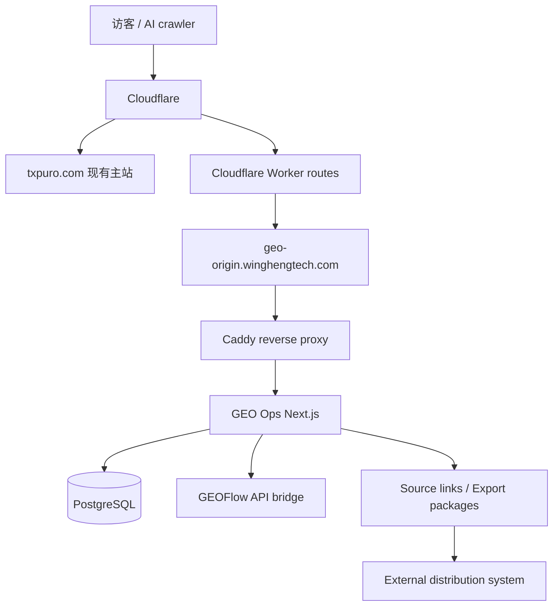

# GEO Ops 系统总手册

Last updated: 2026-05-05

## 1. 系统定位

这套系统不是单一官网，也不是单一内容工具，而是一套围绕 `GEO / AEO / AI Search` 运营的内容情报、生成与源站输出系统。

当前系统可以做“分发”，但分发方式是发布为当前系统自己的公开 URL 和标准化内容包，不直接承担社媒账号连接、OAuth、排期发布和平台风控。外部专门的分发系统负责把这些链接和内容包发布到指定平台账号。

当前实际组成：

- `wingheng.technology`
  内部 GEO Ops 后台，总控台
- `txpuro.com/guides/*`
  对外 GEO 内容区，由当前系统承载
- `txpuro.com`
  现有产品主站，不由本仓库接管
- `geo-origin.winghengtech.com`
  给 Cloudflare 路径代理使用的专用源站入口

## 2. 当前线上拓扑



说明：

- `txpuro.com` 主站继续跑现有系统
- 只有下面这些 path 被 Cloudflare Worker 转到当前 GEO 系统：
  - `/guides`
  - `/guides/*`
  - `/llms.txt`
  - `/sitemap-guides.xml`
- GEO Ops 内部后台仍然挂在 `wingheng.technology`
- 当前系统输出 `txpuro.com/guides/*` 公开链接和后续 `ExportPackage` 内容包，外部分发系统负责发到具体平台账号

## 3. 域名与入口

### 3.1 内部后台

- `https://wingheng.technology`

特点：

- Basic Auth 保护
- 写入 API 需要 `x-geo-ops-action: true`
- 用于内容资产、GEO audit、GEOFlow、Postiz 管理

### 3.2 对外 GEO 内容区

- `https://txpuro.com/guides`
- `https://txpuro.com/guides/*`
- `https://txpuro.com/llms.txt`
- `https://txpuro.com/sitemap-guides.xml`

特点：

- 面向搜索引擎、AI crawler、外部访客公开
- canonical 固定落在 `txpuro.com`
- 页面内容由本系统直接输出

### 3.3 专用源站

- `https://geo-origin.winghengtech.com`

特点：

- 不作为对外品牌入口
- 仅作为 Cloudflare Worker 回源目标
- 当前已经可正常提供 HTTPS

## 4. 系统模块

### 4.1 GEO Ops

职责：

- 内容资产 `ContentAsset`
- GEO brief
- GEO audit
- 渠道变体 `ChannelVariant`
- GEOFlow 发送与同步
- Source links / Export packages
- Distribution status callback
- 系统健康检查与操作审计

核心页面：

- Overview
- Assets
- GEO Runs
- Channels
- Settings

### 4.2 Txpuro Guides 内容层

职责：

- 承载 GEO 内容页
- 输出结构化页面、FAQ、对比页、功能页
- 输出 `llms.txt`
- 输出 `sitemap-guides.xml`
- 承接主站导流流量

### 4.3 GEOFlow Bridge

职责：

- 向 GEOFlow 创建任务
- 入队生成内容
- 轮询同步文章状态
- 回写 published article URL 到内容资产

### 4.4 Source Links / Export Packages

职责：

- 将内容发布为当前系统源站 URL
- 输出可被下游系统读取的内容包
- 记录外部分发系统回传的发布状态
- Postiz 如继续使用，只作为可选下游分发系统之一，不再是当前系统核心模块

## 5. 数据模型

### 5.1 ContentAsset

内容主档。

当前已经支持：

- 标题、正文、摘要
- 品牌实体
- 来源 URL
- 关键词
- canonical URL
- 状态
- GEO 分数
- slug
- locale
- assetType
- audience
- seoTitle
- metaDescription
- faqs
- schemaType
- ctaMode
- publishTarget
- isPublic
- publishedPath

### 5.2 GeoRun

GEO 审计结果。

保存：

- provider
- prompt
- locale
- score
- answer
- cited domains
- recommendations
- contentAssetId

### 5.3 ChannelVariant

渠道版本。

保存：

- contentAssetId
- platform
- copy
- mediaAssets
- scheduledAt
- status

### 5.4 GeoFlowTaskLink

GEO Ops 资产和 GEOFlow task/article 的映射。

### 5.5 AuditEvent

关键写入动作的审计记录。

## 6. 当前 Txpuro 内容结构

### 6.1 首页

- `/guides`

### 6.2 功能与商业页

- `/guides/pricing`
- `/guides/features`
- `/guides/features/myinvois-integration`
- `/guides/features/bulk-import`
- `/guides/features/email-whatsapp-delivery`
- `/guides/features/credit-note-debit-note-vs-void`
- `/guides/features/bilingual-interface`
- `/guides/features/api-integration`

### 6.3 指南页

- `/guides/what-is-myinvois`
- `/guides/malaysia-einvoice-implementation-timeline`
- `/guides/how-to-start-einvoice-for-sme`
- `/guides/self-billed-einvoice-malaysia`
- `/guides/credit-note-vs-debit-note-vs-void`
- `/guides/einvoice-api-vs-portal`

### 6.4 对比页

- `/guides/compare/txpuro-vs-myinvois-portal`
- `/guides/compare/txpuro-vs-manual-process`
- `/guides/compare/txpuro-vs-custom-build`

### 6.5 说明页

- `/guides/faq`
- `/guides/about`
- `/guides/contact`
- `/guides/security`
- `/guides/implementation-support`

## 7. Cloudflare 当前落法

当前正式可用的方式是 **Workers Routes**，不是 Page Rules，也不是当前套餐下受限的 Origin Rules override。

### 7.1 Worker 作用

只接管这些 path：

- `txpuro.com/guides`
- `txpuro.com/guides/*`
- `txpuro.com/llms.txt`
- `txpuro.com/sitemap-guides.xml`

可选同步接管：

- `www.txpuro.com/guides`
- `www.txpuro.com/guides/*`
- `www.txpuro.com/llms.txt`
- `www.txpuro.com/sitemap-guides.xml`

### 7.2 Worker 回源目标

- `geo-origin.winghengtech.com`

### 7.3 为什么不用 Page Rules

因为 Page Rules 更适合做：

- 跳转
- 缓存
- 边缘参数

不适合做当前这种 path 级反向代理回源。

## 8. 安全控制

### 8.1 后台

- Basic Auth
- 登录失败限流
- 安全头
- 写入 header 防护

### 8.2 写入接口

所有写入类接口要求：

- 已通过 Basic Auth
- 请求头包含 `x-geo-ops-action: true`

### 8.3 健康检查

- `GET /api/healthz`

用途：

- Docker healthcheck
- 反向代理探活

## 9. 运维位置

服务器：

- `47.239.166.249`

应用目录：

- `/opt/geo-content-ops`

关键文件：

- `/opt/geo-content-ops/.env`
- `/opt/geo-content-ops/deploy/docker-compose.prod.example.yml`
- `/opt/geo-content-ops/deploy/Caddyfile.example`

备份目录：

- `/opt/geo-content-ops/backups`

## 10. 常用命令

### 10.1 查看容器

```bash
cd /opt/geo-content-ops
docker compose -f deploy/docker-compose.prod.example.yml ps
```

### 10.2 查看日志

```bash
cd /opt/geo-content-ops
docker compose -f deploy/docker-compose.prod.example.yml logs -f geo-ops
docker compose -f deploy/docker-compose.prod.example.yml logs -f reverse-proxy
```

### 10.3 重新部署

```powershell
.\deploy\remote-deploy.ps1 -HostName 47.239.166.249 -User root -KeyPath "$env:USERPROFILE\.ssh\geo_ops_deploy_ed25519"
```

### 10.4 备份数据库

```bash
cd /opt/geo-content-ops
APP_DIR=/opt/geo-content-ops RETENTION_DAYS=14 bash deploy/backup-postgres.sh
```

## 11. 当前系统使用流程

1. 在 `wingheng.technology` 登录后台
2. 创建或编辑 `ContentAsset`
3. 生成 GEO brief
4. 跑 GEO audit
5. 如需长文生产，发送到 GEOFlow
6. 发布成功后同步 GEOFlow 状态
7. 发布为当前系统源站 URL，或生成可分发内容包
8. 外部分发系统通过 URL/API 拉取内容并发布到指定平台
9. 外部分发系统回传发布状态
10. 对外流量通过主站、AI 搜索或分发平台进入 `txpuro.com/guides/*`

## 12. 当前文档清单

- [wingheng-local-ops-index.md](./wingheng-local-ops-index.md)
- [system-reference.md](./system-reference.md)
- [system-sop.md](./system-sop.md)
- [architecture.md](./architecture.md)
- [server-47.239.166.249-deployment.md](./server-47.239.166.249-deployment.md)
- [geoflow-rollout.md](./geoflow-rollout.md)
- [txpuro-geo-strategy.md](./txpuro-geo-strategy.md)
- [txpuro-main-site-entry-plan.md](./txpuro-main-site-entry-plan.md)
- [content-source-and-distribution-boundary.md](./content-source-and-distribution-boundary.md)
