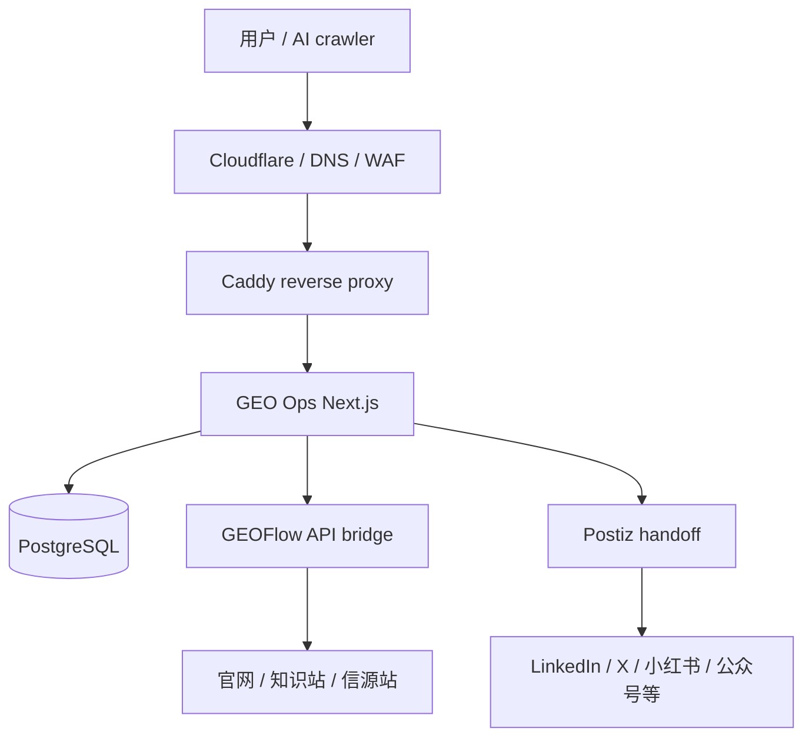

# Wingheng GEO Ops 本地文档索引

Last updated: 2026-05-05

这份文档用于快速定位当前远程部署、系统架构设计、账号密码保存位置。它不包含明文密码，可以提交到 Git。明文凭证只保存在本地 `.secrets/`。

## 1. 当前远程部署

| 项目 | 当前值 |
| --- | --- |
| 服务器公网 IP | `47.239.166.249` |
| 主域名 | `wingheng.technology` |
| 临时 IP 入口 | `http://47.239.166.249` |
| 正式入口 | `https://wingheng.technology` |
| 远程目录 | `/opt/geo-content-ops` |
| Docker Compose 文件 | `/opt/geo-content-ops/deploy/docker-compose.prod.example.yml` |
| 生产 env | `/opt/geo-content-ops/.env` |
| 本地部署脚本 | `deploy/remote-deploy.ps1` |
| 本地 SSH key | `C:\Users\admin\.ssh\geo_ops_deploy_ed25519` |

线上服务状态最近一次验证：

| 服务 | 状态 |
| --- | --- |
| `geo-ops` | running, healthy |
| `postgres` | running, healthy |
| `reverse-proxy` | running |
| `/api/healthz` | `200` |
| 未登录访问 `/` | `401` |
| 写入 API | 需要 Basic Auth + `x-geo-ops-action: true` |

详细远程部署文档：

- [server-47.239.166.249-deployment.md](./server-47.239.166.249-deployment.md)

## 2. 系统架构设计

当前系统采用单机 MVP 部署，但架构边界按生产实践拆分：



核心职责：

| 模块 | 职责 |
| --- | --- |
| GEO Ops | 总控台、内容资产、GEO audit、brief、社媒 variants、GEOFlow/Postiz handoff |
| GEOFlow | 知识库、AI 内容生成、文章审核、前台信源站发布 |
| Postiz | 社媒账号连接、预览、排期、发布 |
| PostgreSQL | ContentAsset、GeoRun、ChannelVariant、GeoFlowTaskLink、GeoFlowSyncRun、AuditEvent |
| Caddy | 反向代理，当前兼容 Cloudflare Flexible，后续建议 Full strict |

详细架构文档：

- [architecture.md](./architecture.md)
- [geoflow-rollout.md](./geoflow-rollout.md)

## 3. 账号密码保存位置

明文账号密码不写入 `docs/`，只保存在本地私密目录：

| 类型 | 本地保存位置 | 说明 |
| --- | --- | --- |
| GEO Ops 管理员账号密码 | `.secrets/wingheng-geo-ops-credentials.md` | 包含登录账号、密码、远程目录、常用命令 |
| 远程 `.env` 快照 | `.secrets/wingheng-prod.env.snapshot` | 从 `/opt/geo-content-ops/.env` 同步 |
| Git 忽略规则 | `.gitignore` | `.secrets/` 已被忽略 |

远程保存位置：

| 类型 | 远程路径 |
| --- | --- |
| 生产 env | `/opt/geo-content-ops/.env` |
| 远程凭证文档 | `/opt/geo-content-ops/.credentials/geo-ops-admin.md` |

## 4. 常用操作

本地部署到服务器：

```powershell
.\deploy\remote-deploy.ps1 -HostName 47.239.166.249 -User root -KeyPath "$env:USERPROFILE\.ssh\geo_ops_deploy_ed25519" -RunMigrations
```

登录服务器：

```powershell
ssh -i "$env:USERPROFILE\.ssh\geo_ops_deploy_ed25519" root@47.239.166.249
```

查看线上容器：

```bash
cd /opt/geo-content-ops
docker compose -f deploy/docker-compose.prod.example.yml ps
```

查看应用日志：

```bash
cd /opt/geo-content-ops
docker compose -f deploy/docker-compose.prod.example.yml logs -f geo-ops
```

执行数据库备份：

```bash
cd /opt/geo-content-ops
APP_DIR=/opt/geo-content-ops RETENTION_DAYS=14 bash deploy/backup-postgres.sh
```

## 5. 当前未完成的外部事项

- GitLab SSH public key 尚未授权，所以 `git push` 仍会报 `Permission denied (publickey)`。
- root 初始测试密码后续需要轮换。
- Cloudflare 当前可测试，正式生产建议切到 `Full (strict)`。
- GEOFlow、Postiz、AI provider keys 需要按正式业务继续补齐或轮换。
